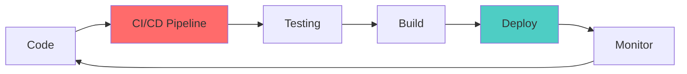
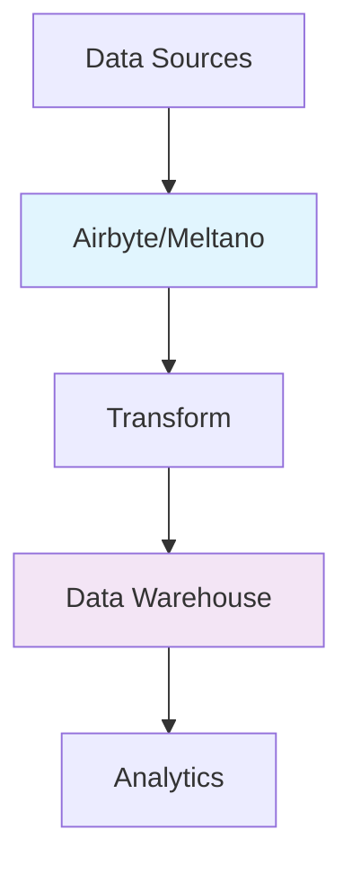
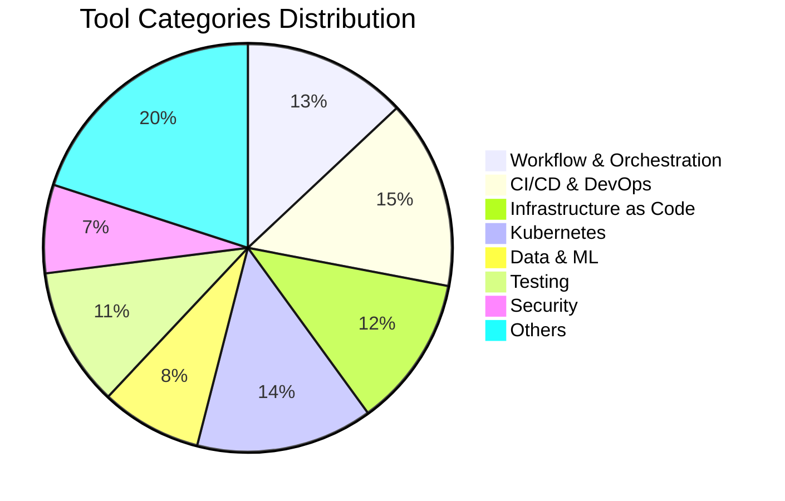

# 🚀 The Ultimate Collection: 100+ GitHub Automation Tools

<div align="center">


*A curated collection of the most powerful automation tools to supercharge your development workflow*

[](https://github.com/username/repo/stargazers)
[](https://github.com/username/repo/network/members)
[](https://github.com/username/repo/issues)
[](https://github.com/username/repo/blob/main/LICENSE)

</div>

---

## 📋 Table of Contents

<details>
<summary>Click to expand navigation</summary>

- [🎯 Overview](#-overview)
- [⚡ Workflow & Orchestration](#-workflow--orchestration)
- [🔄 CI/CD & DevOps](#-cicd--devops)
- [🏗️ Infrastructure as Code](#️-infrastructure-as-code)
- [☸️ Kubernetes & Container Orchestration](#️-kubernetes--container-orchestration)
- [🤖 Data & ML Automation](#-data--ml-automation)
- [📋 Task Management & Scheduling](#-task-management--scheduling)
- [🖥️ Desktop & RPA Automation](#️-desktop--rpa-automation)
- [🧪 Testing & Quality Assurance](#-testing--quality-assurance)
- [👨‍💻 Developer Experience & Productivity](#-developer-experience--productivity)
- [🔒 Security & Compliance](#-security--compliance)
- [🏠 Specialized Automation](#-specialized-automation)
- [🤝 Contributing](#-contributing)
- [📄 License](#-license)

</details>

---

## 🎯 Overview

Welcome to the most comprehensive collection of GitHub automation tools! This repository serves as your one-stop destination for discovering powerful open-source tools that can automate every aspect of your development lifecycle.

### 🌟 What's Inside?

- **100+ curated tools** across 12 major categories
- **Active open-source projects** with strong community support
- **Production-ready solutions** used by top tech companies
- **Easy-to-navigate structure** with clear categorization

### 🎪 Quick Start Guide

1. **Browse by category** using the table of contents
2. **Click on any tool** to visit its GitHub repository
3. **Star this repo** to keep it handy for future reference
4. **Contribute** by suggesting new tools or improvements

---

## ⚡ Workflow & Orchestration

*Powerful platforms for connecting apps, automating workflows, and orchestrating complex processes*

<div align="center">

| Tool | Description | Language | Stars |
|------|-------------|----------|-------|
| **[n8n](https://github.com/n8n-io/n8n)** | Visual workflow automation platform | TypeScript | ⭐⭐⭐⭐⭐ |
| **[Node-RED](https://github.com/node-red/node-red)** | Flow-based development for IoT | JavaScript | ⭐⭐⭐⭐⭐ |
| **[Huginn](https://github.com/huginn/huginn)** | Monitor & automate online tasks | Ruby | ⭐⭐⭐⭐ |

</div>

### 🔥 Featured Tools

- **[n8n](https://github.com/n8n-io/n8n)** – Workflow automation platform for connecting apps and automating tasks
- **[Node-RED](https://github.com/node-red/node-red)** – Flow-based development tool for visual programming of event-driven applications
- **[Huginn](https://github.com/huginn/huginn)** – Create agents that monitor and automate tasks online
- **[Windmill](https://github.com/windmill-labs/windmill)** – Automation tool for workflows, scripts, and integrations
- **[Temporal](https://github.com/temporalio/temporal)** – Microservice orchestration platform for running workflows reliably

### 🏢 Enterprise Solutions

- **[Apache Airflow](https://github.com/apache/airflow)** – Platform to programmatically author, schedule, and monitor workflows
- **[Prefect](https://github.com/PrefectHQ/prefect)** – Dataflow automation platform for orchestrating data workflows
- **[Dagster](https://github.com/dagster-io/dagster)** – Data orchestrator for machine learning, analytics, and ETL
- **[Luigi](https://github.com/spotify/luigi)** – Python module for building complex pipelines of batch jobs
- **[Argo Workflows](https://github.com/argoproj/argo-workflows)** – Container-native workflow engine for Kubernetes

### 🌐 Integration Platforms

- **[Apache NiFi](https://github.com/apache/nifi)** – Data logistics platform for automating data flow between systems
- **[Azkaban](https://github.com/azkaban/azkaban)** – Batch workflow job scheduler for Hadoop
- **[Apache Camel](https://github.com/apache/camel)** – Integration framework based on enterprise integration patterns

---

## 🔄 CI/CD & DevOps

*Continuous Integration, Continuous Deployment, and GitOps tools for modern software delivery*

### 🚀 CI/CD Platforms

<div align="center">



</div>

- **[Jenkins](https://github.com/jenkinsci/jenkins)** – Popular open-source automation server for building, deploying, and automating software
- **[GitLab Runner](https://github.com/gitlab-org/gitlab-runner)** – The runner for GitLab CI/CD pipelines
- **[Tekton Pipelines](https://github.com/tektoncd/pipeline)** – Kubernetes-native CI/CD pipeline engine
- **[Drone](https://github.com/harness/drone)** – Container-native, scalable CI/CD platform
- **[Woodpecker CI](https://github.com/woodpecker-ci/woodpecker)** – Community fork of Drone CI for simple, container-based pipelines

### 🌊 GitOps & Continuous Delivery

- **[Spinnaker](https://github.com/spinnaker/spinnaker)** – Multi-cloud continuous delivery platform
- **[Jenkins X](https://github.com/jenkins-x/jx)** – Kubernetes-native CI/CD platform by Jenkins
- **[GoCD](https://github.com/gocd/gocd)** – Open-source CI/CD server for automating build and deployment pipelines
- **[Dagger](https://github.com/dagger/dagger)** – DevOps platform for building powerful CI/CD pipelines
- **[Concourse](https://github.com/concourse/concourse)** – Open-source CI/CD system with a focus on simplicity and scalability

### 📦 Release Management

> 🎯 **Pro Tip**: Combine semantic-release with conventional commits for fully automated releases!

- **[semantic-release](https://github.com/semantic-release/semantic-release)** – Automates versioning and changelog generation with semantic versioning
- **[release-please](https://github.com/googleapis/release-please)** – Automate releases with conventional commits and changelogs
- **[changesets](https://github.com/changesets/changesets)** – Manage versioning and changelogs for JS monorepos
- **[commitlint](https://github.com/conventional-changelog/commitlint)** – Lint commit messages for conventional commit format
- **[GoReleaser](https://github.com/goreleaser/goreleaser)** – Deliver Go binaries as fast and easily as possible
- **[fastlane](https://github.com/fastlane/fastlane)** – Automate building and releasing iOS and Android apps
- **[danger](https://github.com/danger/danger)** – Automate code review chores with custom rules

---

## 🏗️ Infrastructure as Code

*Manage your infrastructure through code with these powerful automation tools*

### ⚡ Core IaC Tools

<div align="center">


</div>

- **[Terraform](https://github.com/hashicorp/terraform)** – Infrastructure as Code tool for building, changing, and managing infrastructure
- **[OpenTofu](https://github.com/opentofu/opentofu)** – Open-source fork of Terraform
- **[Terragrunt](https://github.com/gruntwork-io/terragrunt)** – Thin wrapper for Terraform for DRY configurations
- **[Atlantis](https://github.com/runatlantis/atlantis)** – Terraform automation for teams via pull request workflow
- **[Infracost](https://github.com/infracost/infracost)** – Cloud cost estimates for Terraform in pull requests

### 🔧 Configuration Management

- **[Ansible](https://github.com/ansible/ansible)** – Automation platform for IT infrastructure
- **[Pulumi](https://github.com/pulumi/pulumi)** – Modern IaC platform that uses programming languages
- **[Salt](https://github.com/saltstack/salt)** – Remote execution and configuration management system
- **[Chef Infra](https://github.com/chef/chef)** – Infrastructure automation platform
- **[Puppet](https://github.com/puppetlabs/puppet)** – IT automation and configuration management

### ☁️ Cloud Automation

- **[Cloud Custodian](https://github.com/cloud-custodian/cloud-custodian)** – Rules engine for managing public cloud accounts
- **[CloudQuery](https://github.com/cloudquery/cloudquery)** – Extract, transform, and load cloud assets into databases
- **[AWS CDK](https://github.com/aws/aws-cdk)** – Define cloud infrastructure using familiar programming languages
- **[CDK for Terraform](https://github.com/hashicorp/terraform-cdk)** – Use TypeScript and Python to define Terraform infrastructure

### 🛡️ Policy as Code

- **[Open Policy Agent](https://github.com/open-policy-agent/opa)** – Policy engine to enforce policies across the stack
- **[Conftest](https://github.com/open-policy-agent/conftest)** – Test configuration files using Open Policy Agent
- **[Checkov](https://github.com/bridgecrewio/checkov)** – Static code analysis tool for IaC security
- **[tfsec](https://github.com/aquasecurity/tfsec)** – Security scanner for Terraform code
- **[Terrascan](https://github.com/tenable/terrascan)** – Detect compliance and security violations across IaC

---

## ☸️ Kubernetes & Container Orchestration

*Master container orchestration and GitOps with these Kubernetes-native tools*

### 🎭 GitOps & Deployment

```yaml
# Example GitOps Workflow
apiVersion: argoproj.io/v1alpha1
kind: Application
metadata:
  name: awesome-app
spec:
  source:
    repoURL: https://github.com/your-org/your-app
    path: k8s
    targetRevision: HEAD
```

- **[Argo CD](https://github.com/argoproj/argo-cd)** – Declarative, GitOps continuous delivery for Kubernetes
- **[Flux](https://github.com/fluxcd/flux2)** – Open and extensible GitOps toolkit for Kubernetes
- **[Argo Rollouts](https://github.com/argoproj/argo-rollouts)** – Kubernetes progressive delivery controller
- **[Argo Events](https://github.com/argoproj/argo-events)** – Event-based dependency manager for Kubernetes

### 📦 Package Management

- **[Helm](https://github.com/helm/helm)** – Kubernetes package manager
- **[Kustomize](https://github.com/kubernetes-sigs/kustomize)** – Customize Kubernetes objects through patches and overlays

### 🔄 Automation & Scaling

- **[KEDA](https://github.com/kedacore/keda)** – Event-driven autoscaling for Kubernetes
- **[Keptn](https://github.com/keptn/keptn)** – Cloud-native application life-cycle orchestration
- **[Crossplane](https://github.com/crossplane/crossplane)** – Control plane framework for cloud-native infrastructure
- **[Kruise](https://github.com/openkruise/kruise)** – Automate workload management on Kubernetes
- **[Kured](https://github.com/kubereboot/kured)** – Automated node reboot daemon for Kubernetes

### 🏗️ Cluster Management

- **[Rancher Fleet](https://github.com/rancher/fleet)** – Manage thousands of Kubernetes clusters
- **[kOps](https://github.com/kubernetes/kops)** – Kubernetes operations, production-grade k8s installation
- **[Cluster API](https://github.com/kubernetes-sigs/cluster-api)** – Manage Kubernetes clusters declaratively
- **[Operator SDK](https://github.com/operator-framework/operator-sdk)** – Build Kubernetes operators with ease

### 🧠 ML on Kubernetes

- **[Kubeflow Pipelines](https://github.com/kubeflow/pipelines)** – ML workflow orchestration on Kubernetes

---

## 🤖 Data & ML Automation

*Streamline your data pipelines and machine learning workflows*

### 📊 Data Integration & ETL

<div align="center">



</div>

- **[Airbyte](https://github.com/airbytehq/airbyte)** – Open-source ELT platform for data integration
- **[Meltano](https://github.com/meltano/meltano)** – Open-source data integration and transformation platform
- **[Pachyderm](https://github.com/pachyderm/pachyderm)** – Data versioning, pipelines, and end-to-end reproducibility for data science

### 🧠 ML Lifecycle Management

> 💡 **Best Practice**: Use DVC for data versioning and MLflow for experiment tracking in your ML projects

- **[DVC](https://github.com/iterative/dvc)** – Version control system for machine learning projects
- **[MLflow](https://github.com/mlflow/mlflow)** – Platform for managing the ML lifecycle, including experimentation and deployment
- **[Kedro](https://github.com/kedro-org/kedro)** – Framework for creating reproducible, maintainable data science code
- **[Metaflow](https://github.com/Netflix/metaflow)** – Human-friendly Python framework for data science workflows
- **[BentoML](https://github.com/bentoml/BentoML)** – Open-source platform for serving, managing, and deploying machine learning models

### ⚡ Distributed Computing

- **[Ray](https://github.com/ray-project/ray)** – Framework for building and running distributed applications
- **[Flyte](https://github.com/flyteorg/flyte)** – Cloud-native workflow automation platform for machine learning and data processing

---

## 📋 Task Management & Scheduling

*Efficient task execution, job scheduling, and background processing*

### 🐍 Python Ecosystem

<div align="center">

| Tool | Use Case | Performance | Learning Curve |
|------|----------|-------------|----------------|
| **Celery** | Distributed Tasks | ⭐⭐⭐⭐⭐ | ⭐⭐⭐ |
| **RQ** | Simple Queues | ⭐⭐⭐⭐ | ⭐⭐ |
| **Dramatiq** | Fast Processing | ⭐⭐⭐⭐⭐ | ⭐⭐⭐ |

</div>

- **[Celery](https://github.com/celery/celery)** – Distributed task queue for Python
- **[RQ](https://github.com/rq/rq)** – Simple Python library for queueing jobs and processing them in the background
- **[Dramatiq](https://github.com/Bogdanp/dramatiq)** – Fast and reliable distributed task processing
- **[APScheduler](https://github.com/agronholm/apscheduler)** – Python job scheduling library

### 🟢 Node.js Ecosystem

- **[BullMQ](https://github.com/taskforcesh/bullmq)** – High-performance job queue for Node.js
- **[Agenda](https://github.com/agenda/agenda)** – Lightweight job scheduling for Node.js

### 💎 Ruby Ecosystem

- **[Sidekiq](https://github.com/mperham/sidekiq)** – Simple, efficient background processing for Ruby

### 🛠️ Build Tools & Task Runners

- **[Taskfile (go-task)](https://github.com/go-task/task)** – Task runner and build tool for Go projects
- **[Just](https://github.com/casey/just)** – Command runner similar to make
- **[Invoke](https://github.com/pyinvoke/invoke)** – Pythonic task execution tool and library
- **[Fabric](https://github.com/fabric/fabric)** – Python library for executing shell commands remotely
- **[Mage](https://github.com/magefile/mage)** – Make/rake-like build tool using Go
- **[doit](https://github.com/pydoit/doit)** – Task management & automation tool
- **[tox](https://github.com/tox-dev/tox)** – Automation tool for testing in multiple Python environments

---

## 🖥️ Desktop & RPA Automation

*Robotic Process Automation and desktop application automation*

### 🤖 RPA Platforms

> 🎯 **Use Case**: Perfect for automating repetitive business processes across multiple applications

- **[OpenRPA](https://github.com/open-rpa/openrpa)** – Open-source RPA solution for automating desktop and web tasks
- **[RPA Framework (Robocorp)](https://github.com/robocorp/rpaframework)** – Open-source Python libraries for Robotic Process Automation
- **[TagUI](https://github.com/kelaberetiv/TagUI)** – RPA tool for automating web and desktop tasks

### 🖱️ Desktop Automation

- **[AutoHotkey](https://github.com/AutoHotkey/AutoHotkey)** – Scripting language for desktop automation on Windows
- **[SikuliX](https://github.com/RaiMan/SikuliX1)** – Automate tasks using image recognition
- **[robotgo](https://github.com/go-vgo/robotgo)** – Go library for automation of desktop applications
- **[PyAutoGUI](https://github.com/asweigart/pyautogui)** – Python module for GUI automation

---

## 🧪 Testing & Quality Assurance

*Comprehensive testing automation for web, mobile, and API applications*

### 🌐 Web Testing Frameworks

<div align="center">

```javascript
// Example Playwright test
test('should automate like a pro', async ({ page }) => {
  await page.goto('https://example.com');
  await page.click('button[data-testid="start-automation"]');
  await expect(page.locator('h1')).toContainText('Success!');
});
```

</div>

- **[Selenium](https://github.com/SeleniumHQ/selenium)** – Automates browsers for testing web applications
- **[Playwright](https://github.com/microsoft/playwright)** – End-to-end testing for web apps across browsers
- **[Cypress](https://github.com/cypress-io/cypress)** – JavaScript-based end-to-end testing framework
- **[Puppeteer](https://github.com/puppeteer/puppeteer)** – Headless Chrome Node.js API for automated testing
- **[TestCafe](https://github.com/DevExpress/testcafe)** – Automated testing for web applications
- **[Nightwatch](https://github.com/nightwatchjs/nightwatch)** – Automated end-to-end testing framework for web apps

### 📱 Mobile & Cross-Platform

- **[Appium](https://github.com/appium/appium)** – Automation for mobile and desktop apps
- **[Taiko](https://github.com/getgauge/taiko)** – Reliable browser automation

### 🔧 Testing Frameworks

- **[Robot Framework](https://github.com/robotframework/robotframework)** – Generic open-source automation framework
- **[Karate](https://github.com/karatelabs/karate)** – API test automation for testers and developers
- **[Gauge](https://github.com/getgauge/gauge)** – Light-weight cross-platform test automation
- **[Newman (Postman CLI)](https://github.com/postmanlabs/newman)** – Run Postman collections directly from the command line

### ⚡ Performance Testing

- **[k6](https://github.com/grafana/k6)** – Modern load testing tool for developers
- **[Locust](https://github.com/locustio/locust)** – Scalable load testing tool in Python
- **[JMeter](https://github.com/apache/jmeter)** – Java application for load testing and measuring performance
- **[Vegeta](https://github.com/tsenart/vegeta)** – HTTP load testing tool and library
- **[Artillery](https://github.com/artilleryio/artillery)** – Modern performance testing for developers

### 🤝 Contract Testing

- **[Pact](https://github.com/pact-foundation/pact)** – Contract testing for microservices and APIs

---

## 👨‍💻 Developer Experience & Productivity

*Tools to enhance your development workflow and productivity*

### 🔄 Dependency Management

<div align="center">


</div>

> 🚀 **Pro Tip**: Enable both Renovate and Dependabot for comprehensive dependency management!

- **[Renovate](https://github.com/renovatebot/renovate)** – Automate dependency updates in software projects
- **[Dependabot Core](https://github.com/dependabot/dependabot-core)** – Automated dependency updates for GitHub projects

### 🎣 Git Hooks & Code Quality

- **[pre-commit](https://github.com/pre-commit/pre-commit)** – Framework for managing and maintaining multi-language pre-commit hooks
- **[Husky](https://github.com/typicode/husky)** – Modern native Git hooks made easy
- **[lint-staged](https://github.com/okonet/lint-staged)** – Run linters on staged Git files

### 📝 Commit & Release Automation

- **[Commitizen](https://github.com/commitizen/cz-cli)** – Command line tool for creating conventional commits
- **[auto](https://github.com/intuit/auto)** – Automate releases based on pull request labels

### 🛠️ Development Tools

- **[Bashly](https://github.com/DannyBen/bashly)** – Bash CLI generator with YAML config
- **[Taskwarrior](https://github.com/GothenburgBitFactory/taskwarrior)** – Feature-rich command-line task manager

---

## 🔒 Security & Compliance

*Automate security monitoring, incident response, and compliance*

### 🛡️ Security Monitoring

<div align="center">

```yaml
# Example OWASP ZAP automation
name: Security Scan
on: [push]
jobs:
  security:
    runs-on: ubuntu-latest
    steps:
      - uses: actions/checkout@v2
      - name: ZAP Scan
        uses: zaproxy/action-full-scan@v0.4.0
```

</div>

- **[osquery](https://github.com/osquery/osquery)** – SQL-powered operating system instrumentation, monitoring, and analytics
- **[Wazuh](https://github.com/wazuh/wazuh)** – Security monitoring, detection, incident response and compliance
- **[OWASP ZAP](https://github.com/zaproxy/zaproxy)** – Web application security scanner
- **[StreamAlert](https://github.com/airbnb/streamalert)** – Real-time data analysis and alerting framework

### 🚨 Incident Response

- **[TheHive](https://github.com/TheHive-Project/TheHive)** – Scalable, open-source and free Security Incident Response Platform
- **[Cortex](https://github.com/TheHive-Project/Cortex)** – Powerful observable analysis and active response engine

### 🌐 Network Automation

- **[Nornir](https://github.com/nornir-automation/nornir)** – Automation framework for network engineers
- **[Netmiko](https://github.com/ktbyers/netmiko)** – Multi-vendor library to simplify SSH connections to network devices
- **[NAPALM](https://github.com/napalm-automation/napalm)** – Network Automation and Programmability Abstraction Layer with Multivendor support
- **[Batfish](https://github.com/batfish/batfish)** – Network configuration analysis tool

### 📊 Alerting & Monitoring

- **[Alertmanager](https://github.com/prometheus/alertmanager)** – Handles alerts sent by client applications such as Prometheus
- **[Kapacitor](https://github.com/influxdata/kapacitor)** – Open-source framework for processing, monitoring, and alerting on time series data
- **[Alerta](https://github.com/alerta/alerta)** – Alert management system
- **[ElastAlert2](https://github.com/jertel/elastalert2)** – Easy & flexible alerting for Elasticsearch

---

## 🏠 Specialized Automation

*Domain-specific automation tools for various use cases*

### 💬 ChatOps & Team Collaboration

<div align="center">

```coffee
# Example Hubot script
module.exports = (robot) ->
  robot.respond /deploy (.*) to (.*)/, (res) ->
    app = res.match[1]
    environment = res.match[2]
    res.send "Deploying #{app} to #{environment}..."
```

</div>

- **[Hubot](https://github.com/hubotio/hubot)** – ChatOps automation for DevOps teams
- **[Errbot](https://github.com/errbotio/errbot)** – Chatbot for automation and chat-ops
- **[Lita](https://github.com/litaio/lita)** – ChatOps framework for team collaboration
- **[Opsdroid](https://github.com/opsdroid/opsdroid)** – Framework for building chatbots

### 💾 Backup & Synchronization

- **[rclone](https://github.com/rclone/rclone)** – Command line tool for syncing files and directories to and from cloud storage
- **[restic](https://github.com/restic/restic)** – Fast, secure, efficient backup program
- **[BorgBackup](https://github.com/borgbackup/borg)** – Deduplicating archiver with compression and encryption
- **[Syncthing](https://github.com/syncthing/syncthing)** – Continuous file synchronization between devices
- **[Autorestic](https://github.com/cupcakearmy/autorestic)** – Wrapper around restic simplifying backup configuration

### 📧 Marketing Automation

- **[Mautic](https://github.com/mautic/mautic)** – Open-source marketing automation software

### 🏡 Home Automation

> 🏠 **Smart Living**: Turn your home into a connected ecosystem with these powerful platforms

- **[Home Assistant](https://github.com/home-assistant/core)** – Open-source platform for smart home automation
- **[openHAB](https://github.com/openhab/openhab-core)** – Vendor and technology agnostic open source home automation software

---

## 🤝 Contributing

We welcome contributions from the community! Here's how you can help:

### 🌟 How to Contribute

1. **⭐ Star this repository** if you find it useful
2. **🍴 Fork the repository** to your GitHub account
3. **🔍 Check existing issues** or create new ones for discussion
4. **📝 Submit pull requests** with new tools or improvements
5. **📢 Share with your network** to help others discover these tools

### 📋 Contribution Guidelines

- **Quality over quantity**: Only suggest tools that are actively maintained and widely used
- **Clear descriptions**: Provide concise but informative descriptions
- **Proper categorization**: Place tools in the most appropriate category
- **Check for duplicates**: Ensure the tool isn't already listed

### 🏷️ Suggesting New Tools

When suggesting new tools, please include:
- **GitHub link** and brief description
- **Primary use case** and category
- **Why it's useful** for automation workflows
- **Active maintenance** status

---

## 📊 Repository Stats

<div align="center">


</div>

---

## 📄 License

This project is licensed under the **MIT License** - see the [LICENSE](LICENSE) file for details.

---

<div align="center">

### 🎉 Happy Automating!

*Built with ❤️ by the automation community*

**[⬆ Back to Top](#-the-ultimate-collection-100-github-automation-tools)**

---

## 📈 Trending Tools This Month

<div align="center">

| 🔥 Hot | Tool | Category | Why It's Trending |
|---------|------|----------|-------------------|
| 🚀 | **[Dagger](https://github.com/dagger/dagger)** | CI/CD | Revolutionary CI/CD with code |
| ⚡ | **[Flyte](https://github.com/flyteorg/flyte)** | ML/Data | Next-gen ML orchestration |
| 🌟 | **[OpenTofu](https://github.com/opentofu/opentofu)** | IaC | Open-source Terraform fork |
| 🔥 | **[Windmill](https://github.com/windmill-labs/windmill)** | Workflow | Developer-first automation |

</div>

---

## 🎯 Quick Setup Guides

### 🚀 Getting Started with CI/CD

```yaml
# .github/workflows/automation.yml
name: Automated Workflow
on: [push, pull_request]

jobs:
  test:
    runs-on: ubuntu-latest
    steps:
      - uses: actions/checkout@v4
      - name: Run Tests
        run: npm test
      
  security:
    runs-on: ubuntu-latest
    steps:
      - uses: actions/checkout@v4
      - name: Security Scan
        uses: github/super-linter@v4
```

### 🏗️ Infrastructure as Code Starter

```hcl
# main.tf - Basic Terraform setup
terraform {
  required_providers {
    aws = {
      source  = "hashicorp/aws"
      version = "~> 5.0"
    }
  }
}

provider "aws" {
  region = "us-west-2"
}

resource "aws_instance" "automation_server" {
  ami           = "ami-0abcdef1234567890"
  instance_type = "t3.micro"
  
  tags = {
    Name = "AutomationServer"
    Environment = "Production"
  }
}
```

### 🐳 Docker Automation Setup

```dockerfile
# Dockerfile for automation tools
FROM node:18-alpine

WORKDIR /app

# Install global automation tools
RUN npm install -g \
    semantic-release \
    @commitlint/cli \
    husky \
    lint-staged

COPY package*.json ./
RUN npm install

COPY . .

CMD ["npm", "start"]
```

---

## 🛠️ Tool Selection Guide

### 🎯 Choose by Use Case

| Use Case | Recommended Tools | Difficulty | Setup Time |
|----------|------------------|------------|------------|
| **Basic CI/CD** | GitHub Actions + semantic-release | ⭐⭐ | 30 min |
| **Infrastructure** | Terraform + Atlantis | ⭐⭐⭐ | 2 hours |
| **Data Pipelines** | Airflow + DVC | ⭐⭐⭐⭐ | 4 hours |
| **Kubernetes** | ArgoCD + Helm | ⭐⭐⭐⭐⭐ | 1 day |
| **ML Workflows** | MLflow + Kubeflow | ⭐⭐⭐⭐⭐ | 2 days |

### 🏢 By Organization Size

#### 🚀 Startups & Small Teams
- **CI/CD**: GitHub Actions, Drone
- **Infrastructure**: Terraform, Pulumi
- **Monitoring**: Prometheus + Grafana
- **Testing**: Cypress, k6

#### 🏛️ Enterprise
- **Orchestration**: Apache Airflow, Temporal
- **Security**: OWASP ZAP, Wazuh
- **Compliance**: Open Policy Agent
- **Scale**: Kubernetes + ArgoCD

---

## 🌐 Community & Resources

### 📚 Learning Resources

- **[Automation University](https://testautomationu.applitools.com/)** - Free automation courses
- **[DevOps Roadmap](https://roadmap.sh/devops)** - Complete learning path
- **[Kubernetes Learning](https://kubernetes.io/training/)** - Official K8s training
- **[Terraform Tutorials](https://learn.hashicorp.com/terraform)** - HashiCorp learning

### 💬 Communities

- **[DevOps.com Community](https://devops.com/community/)** - DevOps discussions
- **[r/devops](https://reddit.com/r/devops)** - Reddit community
- **[CNCF Slack](https://slack.cncf.io/)** - Cloud Native discussions
- **[Kubernetes Slack](https://kubernetes.slack.com/)** - K8s community

### 📺 YouTube Channels

- **[TechWorld with Nana](https://www.youtube.com/c/TechWorldwithNana)** - DevOps tutorials
- **[Docker](https://www.youtube.com/user/dockerrun)** - Container automation
- **[Kubernetes](https://www.youtube.com/c/KubernetesCommunity)** - K8s content
- **[HashiCorp](https://www.youtube.com/c/HashiCorp)** - Infrastructure tools

---

## 🔍 Search & Discovery

### 🏷️ Tags Cloud

<div align="center">

`#CI/CD` `#GitOps` `#Kubernetes` `#Terraform` `#Docker` `#Automation` `#DevOps` `#ML` `#DataOps` `#Security` `#Monitoring` `#Testing` `#IaC` `#Workflows` `#Orchestration` `#Microservices` `#CloudNative` `#OpenSource`

</div>

### 🔎 Find Tools by Technology

- **Python**: Celery, Airflow, Prefect, Ansible
- **JavaScript/Node.js**: n8n, Node-RED, BullMQ, Cypress
- **Go**: Terraform, Kubernetes, Prometheus, k6
- **Java**: Jenkins, Apache Camel, JMeter
- **Ruby**: Huginn, Sidekiq, Chef
- **Rust**: Vector, Fluentd alternatives

---

## 📊 Analytics & Metrics

### 📈 Repository Insights

<div align="center">



</div>

### 🏆 Most Popular Categories

1. **🔄 CI/CD & DevOps** - 15 tools
2. **☸️ Kubernetes** - 14 tools  
3. **⚡ Workflow & Orchestration** - 13 tools
4. **🏗️ Infrastructure as Code** - 12 tools
5. **🧪 Testing** - 11 tools

---

## 🎉 Success Stories

### 🌟 Case Studies

> **Netflix**: Uses Metaflow for data science workflows, processing petabytes of data daily
> 
> **Spotify**: Built Luigi for complex data pipeline orchestration, handling billions of tracks
> 
> **Airbnb**: Created StreamAlert for real-time security monitoring across their infrastructure

### 💡 Best Practices from the Community

#### 🔧 Tool Combinations That Work

- **GitOps Stack**: ArgoCD + Kustomize + Helm
- **ML Pipeline**: DVC + MLflow + Kubeflow
- **Security First**: OPA + Falco + OWASP ZAP
- **Full Observability**: Prometheus + Grafana + AlertManager

---

## 🚀 What's Next?

### 🔮 Emerging Trends

- **AI-Powered Automation**: GPT integration in workflows
- **Edge Computing**: Automation at the network edge
- **Serverless Workflows**: FaaS-based automation
- **GitOps Evolution**: More declarative approaches

### 🎯 Upcoming Tools to Watch

- **Backstage**: Developer portal and service catalog
- **Kratix**: Platform-as-a-Product framework
- **Flagger**: Progressive delivery operator
- **Linkerd**: Service mesh automation

---

## 🙏 Acknowledgments

Special thanks to all the amazing open-source contributors who make these tools possible! 

### 🏅 Hall of Fame Contributors

- **HashiCorp Team** - Terraform, Vault, Consul
- **CNCF Community** - Kubernetes ecosystem
- **Apache Foundation** - Airflow, Camel, NiFi
- **Prometheus Team** - Monitoring ecosystem

---

## 📞 Contact & Support

### 🆘 Getting Help

- **🐛 Found a bug?** [Create an issue](https://github.com/username/repo/issues)
- **💡 Have a suggestion?** [Start a discussion](https://github.com/username/repo/discussions)
- **📧 Need support?** [Email us](mailto:support@example.com)
- **💬 Join the chat** [Discord Server](https://discord.gg/automation)

### 🔗 Connect With Us

<div align="center">

[](https://github.com/username)
[](https://twitter.com/username)
[](https://linkedin.com/in/username)
[](https://discord.gg/automation)

</div>

---

<div align="center">

### 🎊 Thank You for Being Part of the Automation Revolution!


**Made with 🤖 automation, ❤️ passion, and ☕ coffee**

*Last updated: September 2025*

</div>
