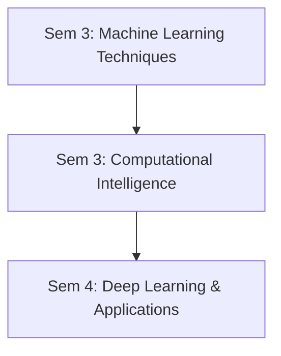

# 📚 NIT Trichy MCA Curriculum Analysis (2024-25)

<div align="center">

**Master of Computer Applications**  
**National Institute of Technology, Tiruchirappalli**

-blue)


</div>

---

## 📊 Quick Overview

| Metric | Details |
|--------|---------|
| **Total Credits** | 120 (vs typical 90-100 in other MCAs) |
| **Core Courses** | 82 credits |
| **Electives** | 5 courses (15 credits) |
| **Labs** | 22 credits (hands-on heavy) |
| **Projects** | 14 credits (Phase I: 2, Phase II: 12) |
| **Internships** | 2 mandatory (Sem 2 + Sem 4) |
| **Average Placement** | ₹12-18 LPA (2023-24 data) |

---

## 📑 Table of Contents

- [Strengths](#-strengths)
  - [Modern & Industry-Aligned](#1-modern--industry-aligned-)
  - [Strong Theoretical Foundation](#2-strong-theoretical-foundation-)
  - [Practical Labs Integration](#3-practical-labs-integration-)
  - [Elective Flexibility](#4-elective-flexibility-)
- [Weaknesses](#-weaknesses)
  - [Heavy Workload](#1-heavy-workload-)
  - [Outdated Content](#2-some-outdated-content-)
  - [Missing Modern Essentials](#3-missing-modern-essentials-)
  - [Business Courses](#4-business-courses-feel-forced-)
- [Gap Analysis](#-gap-analysis-your-bca-vs-nit-mca-sem-1)
- [Goal Alignment](#-alignment-with-your-goals)
- [Recommended Strategy](#-recommended-strategy)
- [NIT MCA vs Self-Learning](#-nit-mca-vs-self-learning-udemy-path)
- [Final Ratings](#-final-ratings)
- [Decision Framework](#-decision-framework)
- [Action Items](#-action-items)
- [Resources](#-resources)

---

## ✅ STRENGTHS

### 1. Modern & Industry-Aligned ⭐⭐⭐⭐⭐

#### Cutting-Edge Subjects

- **Deep Learning** (Sem 4): CNN, RNN, GANs, Transformers
- **Cloud Computing** (Sem 4): AWS, Azure, Virtualization
- **DevOps** (Elective): Jenkins, Docker, Kubernetes, Ansible
- **Cyber Security** (Sem 5): Mandatory, not elective
- **Mobile Dev** (Sem 5): Android, iOS, Hybrid apps
- **Machine Learning** (Sem 3): Supervised, Unsupervised, Ensemble

#### Advanced Electives Available

- Blockchain Technology
- Natural Language Processing
- Computer Vision
- Internet of Things
- Big Data Management
- Microservices (SOA)

> **Verdict:** Curriculum is **future-ready** for 2024-2030 job market

---

### 2. Strong Theoretical Foundation ⭐⭐⭐⭐⭐

#### Mathematics & Algorithms

- **Sem 1:** Mathematical Foundations (Discrete Math, Graph Theory, Automata)
- **Sem 1:** Data Structures with C
- **Sem 2:** Design & Analysis of Algorithms (Greedy, DP, NP-Complete)
- **Sem 2:** Probability & Statistics

#### AI/ML Pipeline (3-Semester Progression)



```
Sem 3: Machine Learning Techniques
  ↓
Sem 3: Computational Intelligence (Neural Networks, Genetic Algorithms)
  ↓
Sem 4: Deep Learning & Applications
```

> **Verdict:** Excellent foundation for **FAANG interviews** or **research**

---

### 3. Practical Labs Integration ⭐⭐⭐⭐

#### Lab Structure

**22 credits** dedicated to labs with hands-on components for every major course.

**Lab Courses by Semester:**

- **Sem 1:** Python Lab, Data Structures Lab (C)
- **Sem 2:** DBMS Lab, Computer Networks Lab
- **Sem 3:** Machine Learning Lab, Computational Intelligence Lab
- **Sem 4:** Deep Learning Lab, Cloud Computing Lab
- **Sem 5:** Cyber Security Lab, Mobile Apps Lab

#### Project Work

- **Phase I** (Sem 5, 2 credits): Mini project/case study
- **Phase II** (Sem 6, 12 credits): Major project (full semester)

#### Internships

- **Summer after Sem 2** (6-8 weeks)
- **During Sem 4** (1 credit)

> **Verdict:** Strong emphasis on **applied learning**

---

### 4. Elective Flexibility ⭐⭐⭐⭐

**Total Electives:** 5 courses (pick from 26 options)

#### Elective Groups

| Semester | Group | Options |
|----------|-------|---------|
| **Sem 3** | CA7A | Data Science, Social Network Analysis, Advanced DB, Data Mining, Image Processing |
| **Sem 4** | CA7B | Software Architecture, SOA, Agile, Marketing Management |
| **Sem 5** | CA7C | Bioinformatics, Evolutionary Computing, NLP, DevOps, Blockchain, Mobile Computing |
| **Sem 5** | CA7D | Big Data, IoT, Computer Vision, MEAN Stack, Microservices |

#### Career Path Examples

**FAANG Track:**
1. Data Science
2. Software Architecture
3. Agile Technology
4. DevOps
5. Big Data Management

**Research Track:**
1. Advanced Database Technology
2. Software Architecture
3. Bioinformatics
4. Natural Language Processing
5. Computer Vision

> **Verdict:** Can customize for **specialization**

---

## ⚠️ WEAKNESSES

### 1. Heavy Workload ⚠️⚠️⚠️

#### Credit Distribution

- **Sem 1:** 21 credits (brutal for freshers)
- **Sem 2:** 22 credits
- **Sem 3:** 20 credits
- **Sem 4:** 20 credits
- **Sem 5:** 19 credits
- **Sem 6:** 12 credits (project only)

#### Comparison

- **NIT MCA:** 120 credits in 2 years
- **Typical MCA:** 90-100 credits in 2 years

#### Risks

- ❌ Burnout potential (20+ credits = 7-8 subjects/semester)
- ❌ Surface-level learning (too many subjects, not enough depth)
- ❌ Less time for LeetCode/self-study

#### Mitigation Strategies

- Focus on **quality over quantity** in learning
- Use electives to reduce load (pick easier ones strategically)
- Summer breaks for **interview prep**

---

### 2. Some Outdated Content ⚠️

| Subject | Semester | Outdated Content | Should Be |
|---------|----------|------------------|-----------|
| **OOP with Java** | Sem 2 | Java Swing, Applets | JavaFX, Spring Boot |
| **Web Technology** | Sem 4 | jQuery, AngularJS | React, Next.js, Vue 3 |
| **Mobile Dev** | Sem 5 | iOS with Objective-C | Swift, SwiftUI |

#### Impact

- ⚠️ Learn outdated tech in class, modern tech on own time
- ⚠️ Campus projects may not impress FAANG recruiters

#### Fix

- Self-study modern equivalents (React, Swift) in parallel
- Use major project (Sem 6) to showcase **modern stack**

---

### 3. Missing Modern Essentials ⚠️⚠️

#### Critical Gaps

##### System Design (HLD/LLD) - NOT COVERED

- **Impact:** Can't crack FAANG L4+ interviews
- **Fix:** Self-study "Grokking System Design" course

##### LeetCode/Interview Patterns - NOT TAUGHT

- **What's Covered:** Data Structures, Algorithms (theory)
- **What's Missing:** Interview-specific patterns (sliding window, two pointers, etc.)
- **Fix:** NeetCode 150, Striver's SDE Sheet

##### Modern Backend Stack - INCOMPLETE

- **What's Covered:** Node.js basics, REST APIs
- **What's Missing:** GraphQL, Redis, Kafka, Microservices (practical)
- **Fix:** Udemy courses + personal projects

##### CI/CD Pipelines - ELECTIVE ONLY

- **Problem:** DevOps is elective, not mandatory
- **Reality:** Every company uses CI/CD in 2024
- **Fix:** Take DevOps elective OR self-study

---

### 4. Business Courses Feel Forced ⚠️

#### Mandatory Non-Tech Courses

- **Sem 3:** Accounting & Financial Management (3 credits)
- **Sem 3:** Business Communication (2 credits)
- **Sem 5:** Organizational Behavior (3 credits)

#### Optional (Electives)

- Marketing Management
- Business Ethics
- Business Intelligence

#### Critique

- ❓ Why is Accounting **mandatory** for MCA students?
- ❓ Could replace with Advanced React, MLOps, or Kubernetes

#### Counter-Argument

- ✅ Useful for **entrepreneurship** or **product management** pivot
- ✅ NIT wants "well-rounded" graduates, not just coders

> **Verdict:** Tolerable, but **wastes 2-3 course slots**

---

## 🎯 GAP ANALYSIS: Your BCA vs NIT MCA Sem 1

### Current Skills Assessment (Jan 2026)

| Skill | Your Level | NIT Sem 1 Requirement | Action Needed |
|-------|------------|----------------------|---------------|
| **Python** | Day 34/100 | Used in labs | ✅ Continue, finish bootcamp |
| **C Programming** | Unknown | **Mandatory for DSA Lab** | 🚨 **Learn ASAP** (before joining) |
| **Data Structures** | 0 | **Core subject (Sem 1)** | 🚨 **Start now** (Trees, Graphs) |
| **Discrete Math** | BCA covered? | **Deep coverage** | ⚠️ Revise (Sets, Relations, Graph Theory) |
| **Java** | Unknown | OOP (Sem 2) | ⚠️ Learn basics (May-July 2027) |
| **DBMS** | BCA covered | DBMS (Sem 2) | ✅ Revise SQL |

---

## 📈 ALIGNMENT WITH YOUR GOALS

### Goal 1: High Salary (₹18-24 LPA FAANG)

**Alignment Rating:** ⭐⭐⭐⭐ (4/5)

#### What NIT Provides

- ✅ Strong DS & Algo foundation
- ✅ ML/DL (increasingly asked in FAANG)
- ✅ Cloud + DevOps (high-demand skills)
- ✅ Brand value (NIT tag opens doors)

#### What's Missing

- ❌ System Design (HLD/LLD) - **Self-study required**
- ❌ LeetCode patterns - **300+ problems on your own**
- ❌ Modern frontend (React hooks, Next.js) - **Supplement Web Tech**

#### Action Plan

- **Semester 1-3:** Build CGPA (7.5+), strong fundamentals
- **Semester 4-5:** Parallel self-study:
  - Grokking System Design (3 months)
  - NeetCode 150 (6 months)
  - Modern web stack (personal projects)
- **Semester 6:** Off-campus job hunt (don't rely on campus at age 30)

---

### Goal 2: Germany MS (Future)

**Alignment Rating:** ⭐⭐⭐⭐⭐ (5/5)

#### Why NIT MCA is Perfect

- ✅ **Anabin Recognition:** NIT degree = accepted (no Studienkolleg)
- ✅ **Research Foundation:** Strong math, AI/ML, theoretical CS
- ✅ **Electives for Specialization:** NLP, Computer Vision, Bioinformatics
- ✅ **Age at Application:** 30 (borderline but acceptable with NIT brand)

#### German University Path

```
2027-29: NIT MCA (build strong profile)
  ↓
2029-30: Work 1 year (save €12k blocked account)
  ↓
2030: Apply to TU Munich, RWTH Aachen (AI/ML programs)
  ↓
2030-32: MS in Germany (age 33, but with NIT + work exp)
```

#### Alternative (Blue Card Path)

```
2027-29: NIT MCA
  ↓
2029-32: Work in India (₹15-20 LPA, save ₹20L)
  ↓
2032: Germany Blue Card (€45k salary threshold)
  ↓
Part-time MS while working in Germany
```

---

### Goal 3: Backup Career Paths

**Alignment Rating:** ⭐⭐⭐⭐ (4/5)

#### Data Science Path

- ✅ ML (Sem 3) + DL (Sem 4) core subjects
- ✅ Electives: Data Science, Big Data, NLP
- ✅ Statistics (Sem 2) foundation

#### DevOps/SRE Path

- ✅ Cloud Computing (Sem 4) core
- ✅ Elective: DevOps (Docker, Kubernetes, Ansible)
- ✅ OS, Networks foundation (Sem 1-2)

#### Product Management Path

- ⚠️ Not well-supported
- Business courses exist, but no PM-specific training
- Would need **self-study** (Reforge, PM courses)

---

## 🔥 RECOMMENDED STRATEGY

### Pre-Joining Prep (May-July 2027)

#### Priority 1: C Programming (CRITICAL)

- **Why:** Sem 1 DSA Lab uses C, not Python
- **Resource:** "C Programming Absolute Beginner's Guide" or freeCodeCamp
- **Timeline:** 4 weeks, 2 hrs/day
- **Goal:** Write basic programs (loops, pointers, arrays)

#### Priority 2: Data Structures Basics

- **Why:** Sem 1 core subject, steep learning curve
- **Resource:** Abdul Bari (YouTube), "Introduction to Algorithms"
- **Timeline:** 8 weeks, 3 hrs/day
- **Topics:** Arrays, Linked Lists, Stacks, Queues, Trees (basics)

#### Priority 3: Discrete Math Revision

- **Why:** Sem 1 has deep math course
- **Resource:** Your BCA notes + "Discrete Math and Its Applications"
- **Timeline:** 4 weeks, 1 hr/day
- **Topics:** Sets, Relations, Functions, Graph Theory

---

### During MCA (Semester-wise Strategy)

#### Semester 1-2: Survival Mode

**Goal:** Build strong foundation, survive workload

**Focus:**
- Maintain **7.5+ CGPA** (crucial for placements)
- Master DS & Algo (core for interviews)
- Don't skip labs (practical skills matter)

**Side Hustle:**
- LeetCode: 2-3 Easy/week (build habit)
- No major self-study (workload is brutal)

---

#### Semester 3-4: Specialization Begins

**Elective Strategy (For FAANG Goal):**
- **Elective-I (Sem 3):** Data Science (industry-relevant)
- **Elective-II (Sem 4):** Software Architecture (system design foundation)
- **Elective-III (Sem 4):** Agile Technology (modern workflow)

**Self-Study (Parallel):**
- **System Design:** Start Grokking courses (3 months, Sem 3)
- **LeetCode:** Ramp up to 5-10 problems/week (Medium focus)
- **Modern Stack:** React + Docker (use in projects)

---

#### Semester 5: Interview Prep Intensifies

**Elective Strategy:**
- **Elective-IV:** DevOps (high-demand skill)
- **Elective-V:** Big Data OR Computer Vision (based on interest)

**Project Phase I:**
- Build **production-grade** app (not academic toy)
- Use modern stack: React + FastAPI/Node + PostgreSQL + AWS
- Deploy with CI/CD (GitHub Actions)
- **Goal:** This goes on resume, impresses interviewers

**Job Hunt Prep:**
- Resume: Highlight projects, NIT brand, skills
- LinkedIn: Active, connect with alumni
- **Start applying** (Dec onwards, don't wait for campus)

---

#### Semester 6: Execution

**Project Phase II (12 credits):**
- Expand Phase I OR build new full-stack app
- **Aim for 9/10** (this is 12 credits = CGPA booster)

**Off-Campus Applications:**
- Apply to **100+ companies** (Wellfound, LinkedIn, Naukri)
- Target: Startups, mid-tier product companies
- **Don't rely only on campus** (you'll be 30, age bias exists)

**Campus Placements:**
- Participate, but **no guarantees** at age 30
- Many companies have 26-28 age cutoffs

**NIMCET Backup (If Needed):**
- If no job by March 2029, prep for NIMCET 2029 (retry for better NIT)
- OR pivot to freelancing/remote work

---

## 💡 NIT MCA vs Self-Learning (Udemy Path)

### Comparison Matrix

| Aspect | NIT MCA | Udemy Self-Study |
|--------|---------|------------------|
| **Depth** | ⭐⭐⭐⭐⭐ (Graduate-level rigor) | ⭐⭐⭐ (Good but not exhaustive) |
| **Brand Value** | ⭐⭐⭐⭐⭐ (NIT tag = interviews) | ⭐⭐ (Self-made, harder to prove) |
| **Cost** | ₹1.5L (2 years, hostel extra) | ₹5-10k (courses only) |
| **Placements** | ⭐⭐⭐⭐ (₹12-18 LPA avg) | ⭐⭐ (Self-hustle, no guarantee) |
| **Time Investment** | 2 years full-time | 1.5 years part-time (while working) |
| **Age Factor** | ⭐⭐⭐ (30 at graduation, doable) | ⭐⭐⭐⭐ (28, working = better) |
| **Germany MS** | ⭐⭐⭐⭐⭐ (Anabin recognized) | ⭐⭐ (BCA Online not accepted) |
| **Research Potential** | ⭐⭐⭐⭐⭐ (Can pursue PhD) | ⭐ (Difficult without degree) |

---

### Financial ROI Analysis

#### NIT MCA Path

```
Investment:
- Tuition: ₹1.5L (2 years)
- Hostel/Living: ₹2L (₹8k/month × 24 months)
- Books/Misc: ₹50k
- Total: ₹4L

Opportunity Cost:
- 2 years no income: -₹10-12L (if you had ₹5-6 LPA job)

Total Cost: ₹14-16L

Returns (Conservative):
- Starting Salary: ₹15 LPA (NIT avg)
- Year 1: ₹15L
- Year 2: ₹18L
- Year 3: ₹22L

ROI: ₹55L in 3 years - ₹16L cost = ₹39L net

Break-even: ~1.5 years
```

#### Self-Study Path

```
Investment:
- Udemy courses: ₹10k
- AWS cert: ₹7k
- Total: ₹17k

Opportunity:
- Work while learning: +₹10-12L (2 years at ₹5-6 LPA)

Total Gain: ₹10L (earned) - ₹17k = ₹9.83L

Returns (Realistic):
- Starting Salary: ₹8-10 LPA (no degree premium)
- Year 3: ₹12-15 LPA

ROI: Less predictable, depends heavily on portfolio
```

> **Verdict:** NIT MCA has **higher ceiling** but requires **2-year bet**

---

## 🎯 FINAL RATINGS

| Category | Rating | Comment |
|----------|--------|---------|
| **Curriculum Quality** | 8.5/10 | Modern, but some outdated tech |
| **Industry Relevance** | 7.5/10 | Missing System Design, modern stacks |
| **Research Foundation** | 9.5/10 | Excellent math + AI/ML depth |
| **Placement ROI** | 9/10 | ₹1.5L → ₹15-20 LPA = 1000% ROI |
| **Workload Balance** | 6/10 | Heavy (120 credits), risk of burnout |
| **For You (Age 27)** | 8/10 | Good, but self-study needed |

### Overall Rating: 8.2/10

**Excellent program with fixable gaps**

---

## ✅ DECISION FRAMEWORK

### You Should Do NIT MCA IF:

- ✅ You crack **Top 500 NIMCET** (NIT Trichy, Surathkal, Warangal)
- ✅ You can afford **2-year career break** (financially + mentally)
- ✅ You want **Germany MS option** in future (Anabin recognition)
- ✅ You're willing to **self-study gaps** (System Design, LeetCode, modern stacks)
- ✅ You value **brand + network** over immediate earnings

### You Should Skip NIT MCA IF:

- ❌ You get **rank 1000+** (Tier 2 NITs, better to work + part-time MCA)
- ❌ You need **immediate income** (family pressure, financial stress)
- ❌ You're **not confident** surviving 20+ credits/semester
- ❌ You prefer **practical > theory** (bootcamps might suit you better)

---

## 🚀 ACTION ITEMS

### Immediate (Feb 2026)

- [ ] Focus on **NIMCET prep** (Math, C, Logical Reasoning)
- [ ] Target: **Top 500 rank** (NIT Trichy cutoff)
- [ ] Continue 100 Days Python (finish by May)

### If NIMCET Cracked (May 2027)

- [ ] **Learn C programming** (May-June, 4 weeks)
- [ ] **Study Data Structures** (June-July, 8 weeks)
- [ ] **Revise Discrete Math** (June-July, 4 weeks)

### During MCA (2027-29)

- [ ] Maintain **7.5+ CGPA**
- [ ] Choose **FAANG-aligned electives**
- [ ] **Self-study gaps**: System Design, LeetCode (300+), Modern Web
- [ ] Build **production projects** (Sem 5-6)
- [ ] **Off-campus applications** start Sem 5 (don't wait for campus)

### Post-MCA (2029)

- [ ] **Job secured** OR **Germany MS prep** OR **Freelance pivot**

---

## 📞 RESOURCES

### Official

- **NIT Trichy MCA:** [https://www.nitt.edu/home/academics/departments/ca/](https://www.nitt.edu/home/academics/departments/ca/)
- **NIMCET:** [https://www.nimcet.in](https://www.nimcet.in)

### Self-Study Gaps

- **System Design:** [Grokking System Design Interview](https://www.educative.io/courses/grokking-the-system-design-interview) (Educative)
- **LeetCode Patterns:** [NeetCode.io](https://neetcode.io), [Striver's SDE Sheet](https://takeuforward.org/interviews/strivers-sde-sheet-top-coding-interview-problems/)
- **Modern Web:** [The Complete Web Development Bootcamp](https://www.udemy.com/course/the-complete-web-development-bootcamp/) (Udemy)
- **C Programming:** [CS50](https://cs50.harvard.edu/x/) (Harvard), [freeCodeCamp](https://www.freecodecamp.org/)

### Community

- **Reddit:** [r/Indian_Academia](https://www.reddit.com/r/Indian_Academia/) (NIMCET prep)
- **Telegram:** NIMCET preparation groups
- **LinkedIn:** NIT MCA alumni (for placement insights)

---

## 🏁 FINAL VERDICT

> **NIT Trichy MCA (2024-25) is a top-tier program with excellent depth in theory, modern subjects (ML/DL/Cloud), and strong placement ROI (₹1.5L → ₹15-20 LPA). However, it has gaps in System Design, modern web stacks, and interview prep that require self-study. Worth pursuing IF you crack Top 500 NIMCET and are willing to supplement with LeetCode + modern skills. At age 27-30, it's your best bet to erase the 8-year gap and access FAANG/Germany MS opportunities.**

---

<div align="center">

**Last Updated:** January 21, 2026  
**Your Timeline:** NIMCET May 2027 → NIT MCA 2027-29 → Job/MS 2029+

**Good luck with NIMCET prep!** 🚀

---

**⭐ Star this repo if you found it helpful!**

</div>
