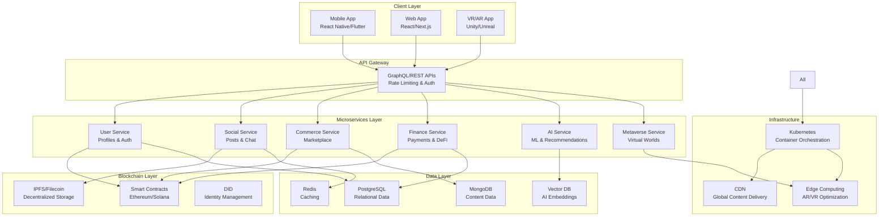

# 🚀 MetaVerseHub (UniVerseX): Complete Project Guide & Roadmap

-blue)

*Building the Future of Decentralized Digital Experiences*

---

## 📋 Table of Contents

1. [🎯 Project Vision](#-project-vision)
2. [📊 Market Analysis](#-market-analysis)
3. [🏗️ System Architecture](#️-system-architecture)
4. [📅 Development Roadmap](#-development-roadmap)
5. [💻 Technology Stack](#-technology-stack)
6. [👥 Team Structure](#-team-structure)
7. [💰 Budget & Resources](#-budget--resources)
8. [⚠️ Challenges & Risks](#️-challenges--risks)
9. [📈 Success Metrics](#-success-metrics)
10. [🔄 Implementation Strategy](#-implementation-strategy)

---

## 🎯 Project Vision

### Overview
**MetaVerseHub (UniVerseX)** is an ambitious decentralized AI-powered SuperApp that aims to revolutionize digital interaction by merging multiple platforms into one comprehensive ecosystem.

### Core Value Proposition
Create a unified digital universe where users can seamlessly transition between:
- **Social Networking** → Community-driven interactions with AI-enhanced experiences
- **E-commerce** → NFT marketplace and traditional commerce integration
- **Financial Services** → DeFi protocols and traditional payment systems
- **Entertainment** → Immersive AR/VR experiences and content creation
- **Productivity** → AI-powered collaboration tools and virtual workspaces

### Mission Statement
*"To democratize access to Web3 technologies while creating the most comprehensive decentralized digital ecosystem that empowers users with true data ownership, financial sovereignty, and immersive experiences."*

---

## 📊 Market Analysis

### Market Opportunity
The convergence of multiple high-growth markets presents an unprecedented opportunity:

| Sector | 2024 Market Size | Projected 2030 Size | CAGR |
|--------|------------------|-------------------|------|
| Metaverse | $105.4B | $936.6B | 46.4% |
| Decentralized Social Media | $3.6B | $15.8B | 20.6% |
| AR/VR | $22.1B | $96.3B | 34.2% |
| DeFi | $13.2B | $231.2B | 46.0% |

### Key Market Drivers
- **Data Privacy Concerns**: Blockchain-based social media networks protect user information from exploitation and unauthorized use
- **Creator Economy Growth**: Direct monetization without intermediaries
- **Web3 Adoption**: Blockchain-based protocols gaining traction among developers, creators, and crypto enthusiasts
- **Immersive Technology**: Virtual Reality (VR) and Augmented Reality (AR) segment held a dominant position, capturing more than 34.2% share

### Competitive Landscape
- **Traditional Platforms**: Meta (Facebook), WeChat, Discord
- **Decentralized Alternatives**: The Diamond App is a standout platform in the blockchain social media landscape
- **Emerging Protocols**: Lens Protocol and Farcaster: Blockchain-based protocols

---

## 🏗️ System Architecture

### High-Level Architecture

### Core Components Deep Dive

#### 1. Frontend Applications
- **Mobile App**: Cross-platform native performance
- **Web Application**: Progressive Web App with offline capabilities
- **VR/AR Interface**: Immersive 3D environments with spatial computing

#### 2. Backend Infrastructure
- **Microservices Architecture**: Scalable, maintainable service separation
- **API Gateway**: Centralized request routing and security
- **Event-Driven Architecture**: Real-time communication and data synchronization

#### 3. Blockchain Integration
- **Multi-Chain Support**: Ethereum for established DeFi, Solana for speed
- **Smart Contract Templates**: Standardized contracts for common operations
- **Decentralized Identity**: Self-sovereign identity management

#### 4. AI/ML Pipeline
- **Recommendation Engine**: Personalized content and product suggestions
- **Content Moderation**: Automated toxicity detection and filtering
- **Virtual Assistants**: AI-powered user support and guidance

---

## 📅 Development Roadmap

### Phase 1: Foundation (Months 0-6) 🏗️
**Goal**: Establish MVP with core social and financial features

#### Technical Milestones
- [ ] **User Management System**
  - Authentication & authorization
  - Profile creation and management
  - Basic KYC integration
  
- [ ] **Social Networking Core**
  - Real-time messaging (WebSocket implementation)
  - Feed system with basic algorithms
  - Friend/follower relationships
  
- [ ] **Wallet Integration**
  - MetaMask and WalletConnect support
  - Basic cryptocurrency transactions
  - Fiat payment gateway integration
  
- [ ] **Infrastructure Setup**
  - Cloud deployment (AWS/GCP)
  - CI/CD pipeline establishment
  - Basic monitoring and logging

#### Success Criteria
- 1,000 active beta users
- 99.9% uptime
- Sub-200ms API response times
- Basic security audit completion

### Phase 2: Ecosystem Expansion (Months 6-18) 🌟
**Goal**: Add commerce, AI features, and decentralization

#### Technical Milestones
- [ ] **E-commerce Platform**
  - Product catalog and search
  - Order management system
  - NFT marketplace integration
  
- [ ] **AI Enhancement**
  - Content recommendation system
  - Automated content moderation
  - Basic chatbot implementation
  
- [ ] **Decentralization Layer**
  - IPFS content storage
  - Basic smart contract deployment
  - Decentralized identity (DID) integration
  
- [ ] **Advanced Features**
  - Multi-language support
  - Advanced analytics dashboard
  - Community governance tools

#### Success Criteria
- 50,000 registered users
- $100K in monthly transaction volume
- 10,000+ NFTs traded
- Community-driven feature requests

### Phase 3: Metaverse Integration (Months 18-30) 🥽
**Goal**: Launch immersive AR/VR experiences

#### Technical Milestones
- [ ] **Metaverse Infrastructure**
  - 3D virtual world creation tools
  - Avatar system and customization
  - Spatial audio and video chat
  
- [ ] **AR/VR Applications**
  - Mobile AR features
  - VR world builder
  - Cross-platform synchronization
  
- [ ] **Advanced AI**
  - AI-powered virtual assistants
  - Predictive analytics
  - Content generation tools
  
- [ ] **Enterprise Features**
  - Virtual office spaces
  - Collaboration tools
  - API for third-party integrations

#### Success Criteria
- 500K total users
- 100+ virtual worlds created
- 1M+ hours spent in VR/AR
- Enterprise pilot programs launched

### Phase 4: Scale & Optimize (Months 30-48) 🚀
**Goal**: Global adoption and platform maturity

#### Technical Milestones
- [ ] **Global Infrastructure**
  - Multi-region deployment
  - Edge computing optimization
  - Advanced caching strategies
  
- [ ] **Advanced Blockchain**
  - Multi-chain interoperability
  - DAO governance implementation
  - Advanced DeFi integrations
  
- [ ] **AI Marketplace**
  - Third-party AI model integration
  - Custom AI training tools
  - AI-as-a-Service offerings
  
- [ ] **Platform Maturity**
  - Advanced security measures
  - Comprehensive analytics
  - White-label solutions

#### Success Criteria
- 5M+ registered users
- $10M+ monthly transaction volume
- Global availability (50+ countries)
- IPO readiness or strategic partnership

---

## 💻 Technology Stack

### Frontend Technologies
| Category | Primary | Alternative | Rationale |
|----------|---------|-------------|-----------|
| **Mobile** | React Native | Flutter | Cross-platform efficiency, shared codebase |
| **Web** | React + Next.js | Vue + Nuxt | SEO optimization, server-side rendering |
| **VR/AR** | Unity | Unreal Engine | Mature ecosystem, WebXR support |
| **State Management** | Redux Toolkit | Zustand | Predictable state updates |

### Backend Technologies
| Category | Primary | Alternative | Rationale |
|----------|---------|-------------|-----------|
| **API** | Node.js + Express | Python + FastAPI | JavaScript ecosystem consistency |
| **Database** | PostgreSQL | MySQL | ACID compliance, JSON support |
| **Cache** | Redis | Memcached | Pub/sub capabilities, data structures |
| **Search** | Elasticsearch | Algolia | Full-text search, analytics |

### Blockchain & Web3
| Category | Technology | Purpose |
|----------|------------|---------|
| **Smart Contracts** | Solidity (Ethereum) | DeFi protocols, NFTs |
| **High Performance** | Rust (Solana) | Gaming, micropayments |
| **Storage** | IPFS/Filecoin | Decentralized file storage |
| **Identity** | DID/Verifiable Credentials | User authentication |

### AI/ML Stack
| Category | Technology | Use Case |
|----------|------------|----------|
| **Framework** | PyTorch | Deep learning models |
| **NLP** | Transformers | Content understanding |
| **Computer Vision** | OpenCV + YOLO | Image/video processing |
| **Recommendation** | TensorFlow Recommenders | Personalization |

### Infrastructure & DevOps
| Category | Technology | Purpose |
|----------|------------|---------|
| **Container** | Docker + Kubernetes | Microservices orchestration |
| **Cloud** | AWS/GCP | Scalable infrastructure |
| **CI/CD** | GitHub Actions | Automated deployment |
| **Monitoring** | Prometheus + Grafana | Performance monitoring |

---

## 👥 Team Structure

### Recommended Team Composition (Phase-by-Phase)

#### Phase 1 Team (8-10 members)
- **Technical Lead** (1) - Architecture decisions, code quality
- **Full-Stack Developers** (3) - Core application development
- **Blockchain Developer** (1) - Smart contracts, Web3 integration
- **AI/ML Engineer** (1) - Recommendation systems, moderation
- **DevOps Engineer** (1) - Infrastructure, deployment
- **UI/UX Designer** (1) - User interface design
- **Product Manager** (1) - Feature prioritization, stakeholder communication
- **QA Engineer** (1) - Testing, quality assurance

#### Phase 2 Expansion (+8-12 members)
- **Mobile Developers** (2) - iOS/Android specialization
- **Frontend Specialists** (2) - React/Web performance
- **Backend Engineers** (2) - Microservices scaling
- **Security Engineer** (1) - Penetration testing, compliance
- **Data Scientists** (2) - Analytics, AI model improvement
- **Marketing Specialist** (1) - Community building, user acquisition

#### Phase 3 Growth (+10-15 members)
- **AR/VR Developers** (3) - Unity/Unreal specialists
- **3D Artists** (2) - Asset creation, world building
- **Game Developers** (2) - Interactive experiences
- **Additional Backend** (3) - Metaverse infrastructure
- **Community Managers** (2) - User engagement, support
- **Business Development** (2) - Partnerships, integrations
- **Legal/Compliance** (1) - Regulatory requirements

### Hiring Strategy
1. **Remote-First Approach**: Access global talent pool
2. **Equity-Heavy Compensation**: Attract top-tier talent with limited budget
3. **Cultural Fit**: Prioritize Web3 enthusiasm and collaborative mindset
4. **Continuous Learning**: Invest in team education and conference attendance

---

## 💰 Budget & Resources

### Development Cost Breakdown

#### Phase 1 (6 months) - $800K - $1.2M
| Category | Cost Range | Details |
|----------|------------|---------|
| **Team Salaries** | $600K - $900K | 10 team members × $10-15K/month |
| **Infrastructure** | $50K - $80K | Cloud services, development tools |
| **Third-party Services** | $30K - $50K | APIs, security audits, legal |
| **Hardware/Equipment** | $20K - $40K | Development machines, testing devices |
| **Marketing/Community** | $50K - $80K | Beta user acquisition, PR |
| **Legal/Compliance** | $30K - $50K | Entity formation, IP protection |
| **Contingency (20%)** | $156K - $240K | Risk mitigation |

#### Total 4-Phase Budget Estimate
- **Conservative Estimate**: $8-12 Million
- **Optimistic Estimate**: $5-8 Million
- **Enterprise-Scale**: $15-25 Million

### Funding Strategy
1. **Seed Round** ($2-3M) - Phase 1 completion
2. **Series A** ($8-12M) - Phase 2-3 execution
3. **Series B** ($20-30M) - Global scaling
4. **Token Launch** (Alternative) - Community-driven funding

### Revenue Projections
| Revenue Stream | Year 1 | Year 2 | Year 3 | Year 4 |
|----------------|--------|--------|--------|--------|
| **Transaction Fees** | $10K | $500K | $5M | $25M |
| **Premium Subscriptions** | $50K | $1M | $8M | $30M |
| **NFT Marketplace** | $5K | $200K | $2M | $10M |
| **Enterprise Licenses** | $0 | $100K | $1M | $5M |
| **Advertising** | $0 | $50K | $500K | $3M |
| **Total** | $65K | $1.85M | $16.5M | $73M |

---

## ⚠️ Challenges & Risks

### Technical Challenges
1. **Scalability Bottlenecks**
   - *Risk*: System performance degradation under load
   - *Mitigation*: Microservices architecture, horizontal scaling
   - *Timeline Impact*: +2-3 months for optimization

2. **Blockchain Integration Complexity**
   - *Risk*: Smart contract vulnerabilities, gas fee volatility
   - *Mitigation*: Extensive testing, multi-chain strategy
   - *Budget Impact*: +$200K for security audits

3. **AR/VR Performance Optimization**
   - *Risk*: Poor user experience due to hardware limitations
   - *Mitigation*: Progressive enhancement, cloud rendering
   - *Resource Requirement*: Specialized talent acquisition

### Market Risks
1. **Regulatory Uncertainty**
   - *Impact*: Potential feature limitations or geographical restrictions
   - *Mitigation*: Legal compliance framework, regulatory monitoring
   - *Cost*: $500K+ for ongoing legal counsel

2. **Competition from Tech Giants**
   - *Risk*: Meta, Google, or Apple launching similar platforms
   - *Mitigation*: Fast execution, unique value proposition
   - *Strategy*: Focus on decentralization advantage

3. **User Adoption Challenges**
   - *Risk*: Slow growth due to Web3 complexity
   - *Mitigation*: Gradual Web3 introduction, excellent UX
   - *Investment*: Enhanced onboarding and education

### Financial Risks
1. **Funding Market Volatility**
   - *Risk*: Difficulty raising subsequent rounds
   - *Mitigation*: Multiple funding sources, revenue diversification
   - *Backup Plan*: Token-based community funding

2. **Development Cost Overruns**
   - *Risk*: 50-100% budget increase (industry standard)
   - *Mitigation*: Agile development, MVP focus
   - *Buffer*: 30% contingency in all estimates

---

## 📈 Success Metrics

### Key Performance Indicators (KPIs)

#### User Metrics
| Metric | Phase 1 Target | Phase 2 Target | Phase 3 Target | Phase 4 Target |
|--------|----------------|----------------|----------------|----------------|
| **Monthly Active Users** | 1K | 50K | 500K | 5M |
| **User Retention (30-day)** | 30% | 50% | 65% | 75% |
| **Average Session Duration** | 15min | 25min | 45min | 60min |
| **Daily Sessions per User** | 2 | 3 | 4 | 5 |

#### Business Metrics
| Metric | Phase 1 | Phase 2 | Phase 3 | Phase 4 |
|--------|---------|---------|---------|---------|
| **Monthly Revenue** | $5K | $150K | $1.5M | $6M |
| **Customer Acquisition Cost** | $50 | $30 | $20 | $15 |
| **Lifetime Value** | $100 | $200 | $400 | $800 |
| **Gross Margin** | 60% | 70% | 75% | 80% |

#### Technical Metrics
- **System Uptime**: >99.9%
- **API Response Time**: <200ms (95th percentile)
- **Transaction Success Rate**: >99.5%
- **Security Incidents**: Zero critical vulnerabilities

### Milestone Celebrations
- **1K Users**: Team dinner, press release
- **10K Users**: Company retreat, angel investor updates
- **100K Users**: Series A announcement, major partnership
- **1M Users**: IPO preparation, global expansion announcement

---

## 🔄 Implementation Strategy

### Development Methodology
**Agile + Lean Startup Hybrid**
- **2-week sprints** with continuous deployment
- **MVP-first approach** for each major feature
- **User feedback loops** every 4 weeks
- **Quarterly OKR reviews** for strategic alignment

### Quality Assurance
1. **Automated Testing**
   - Unit tests (80%+ coverage)
   - Integration tests for critical paths
   - End-to-end testing automation
   
2. **Security Measures**
   - Regular penetration testing
   - Smart contract audits
   - GDPR/CCPA compliance
   
3. **Performance Monitoring**
   - Real-time application monitoring
   - User behavior analytics
   - A/B testing framework

### Risk Mitigation Strategies
1. **Technical Risk**: Parallel development tracks for critical components
2. **Market Risk**: Flexible architecture allowing feature pivots
3. **Financial Risk**: Milestone-based funding releases
4. **Team Risk**: Knowledge documentation and cross-training

### Community Building Strategy
1. **Developer Community**
   - Open-source components
   - Hackathons and developer challenges
   - API documentation and SDKs
   
2. **User Community**
   - Beta testing programs
   - Community governance participation
   - Creator economy incentives
   
3. **Industry Partnerships**
   - Web3 protocol integrations
   - Traditional platform bridges
   - Enterprise pilot programs

---

## 🎯 Conclusion

MetaVerseHub represents a transformative opportunity to create the next generation of digital interaction platforms. With the global metaverse market projected to reach USD 936.57 billion by 2030, growing at a CAGR of 46.4%, the timing is optimal for a comprehensive platform that bridges Web2 and Web3 experiences.

### Success Factors
- **Execution Speed**: First-mover advantage in comprehensive decentralized platforms
- **User Experience**: Seamless integration of complex technologies
- **Community Building**: Strong network effects and user loyalty
- **Technical Excellence**: Scalable, secure, and performant infrastructure

### Next Steps
1. **Immediate (Week 1-2)**:
   - Finalize technical architecture
   - Begin core team recruitment
   - Initiate legal entity formation
   
2. **Short-term (Month 1-3)**:
   - Complete seed funding round
   - Establish development environment
   - Begin MVP development
   
3. **Medium-term (Month 3-6)**:
   - Launch beta testing program
   - Iterate based on user feedback
   - Prepare for Series A fundraising

### Final Thoughts
The convergence of social networking, commerce, finance, entertainment, and productivity into a single decentralized platform represents the future of digital interaction. MetaVerseHub has the potential to become the "WeChat of Web3" - a comprehensive ecosystem that empowers users with true digital sovereignty while providing unprecedented utility and experiences.

The road ahead is challenging but the opportunity is unprecedented. With proper execution, strategic partnerships, and community building, MetaVerseHub can establish itself as the leading platform in the decentralized digital economy.

---

*This document serves as a living blueprint and should be updated regularly as the project evolves and market conditions change.*
