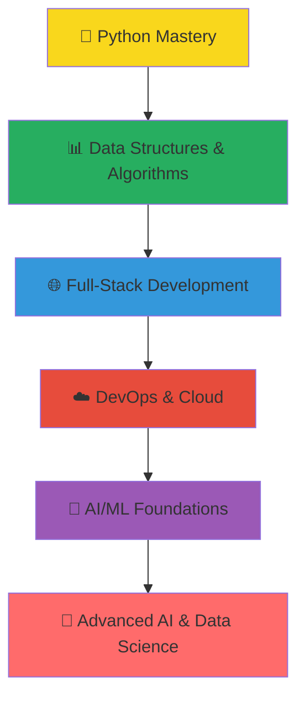
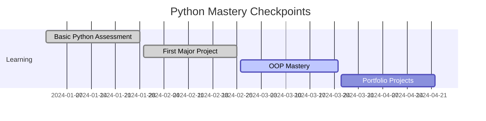
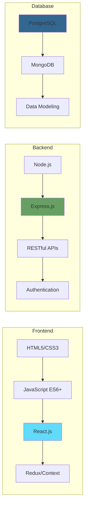
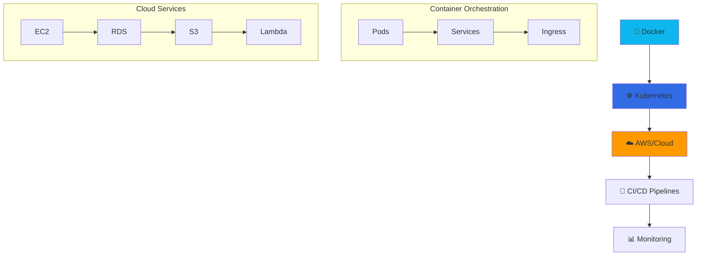
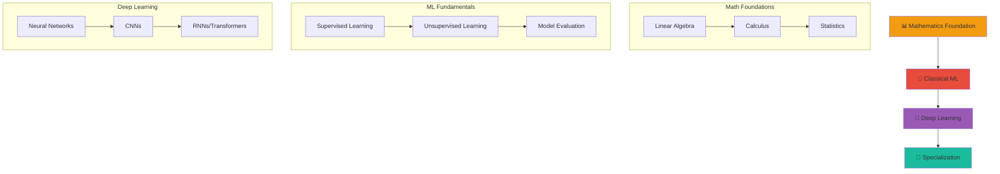
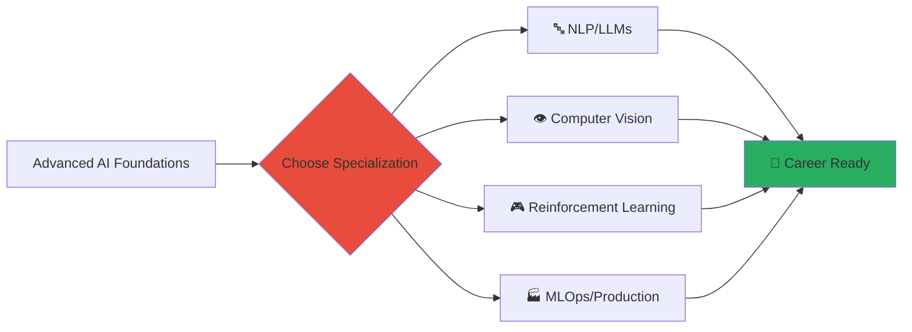
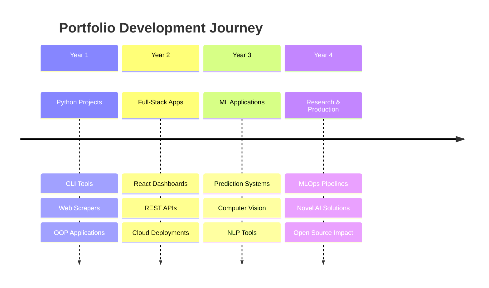

# 🚀 FAANG AI/ML Engineer Learning Roadmap

<div align="center">


**Sequential Learning Path | 3,700+ Hours | Industry-Ready Skills**

*Transform from beginner to FAANG-level AI/ML Engineer through structured, project-driven learning*

</div>

---

## 📋 Table of Contents

- [🎯 Overview](#-overview)
- [🏗️ Learning Architecture](#️-learning-architecture)
- [📅 Year 1: Programming Foundations](#-year-1-programming-foundations--core-cs)
- [🌐 Year 2: Full-Stack & DevOps](#-year-2-full-stack-development--devops)
- [🤖 Year 3: AI/ML Foundations](#-year-3-aiml-foundations--specialization)
- [🧠 Year 4: Advanced AI & Career Prep](#-year-4-advanced-ai--career-preparation)
- [📈 Success Metrics](#-success-metrics--milestones)
- [💰 Investment Summary](#-investment-summary)

---

## 🎯 Overview

This roadmap is designed for **dedicated learners** who want to break into FAANG as AI/ML Engineers. Built on **sequential learning principles** with hands-on projects and real-world applications.

### ✨ Key Features



### 🎯 Success Formula

| Component | Allocation | Purpose |
|-----------|------------|---------|
| **Theory** | 30% | Deep understanding of concepts |
| **Hands-on Projects** | 50% | Portfolio & practical skills |
| **Personal Branding** | 10% | Visibility & networking |
| **Interview Prep** | 10% | FAANG-specific preparation |

---

## 🏗️ Learning Architecture

<details>
<summary><b>🔧 Study Structure</b></summary>

### ⏰ Time Allocation
- **Daily:** 3.5-4 hours (5-6 days/week)
- **Weekly:** 25 hours of focused learning
- **Monthly:** 100+ hours with practical projects
- **Yearly:** 900-1000 hours of skill development

### 📚 Learning Methods
- 📺 **Video Courses** (Coursera, Udemy) - 40%
- 💻 **Hands-on Projects** - 35%
- 📖 **Books & Documentation** - 15%
- 🤝 **Community & Practice** - 10%

</details>

---

## 📅 Year 1: Programming Foundations & Core CS

<div align="center">


</div>

### 🐍 Phase 1: Python Mastery
**📅 Months 1-4 | ⏱️ 400 hours | 🎯 Foundation Building**

<details>
<summary><b>📚 Learning Resources & Timeline</b></summary>

#### 🎓 Primary Courses
- 🌟 **[Complete Python Bootcamp](https://www.udemy.com/course/complete-python-bootcamp/)** (Udemy - Jose Portilla)
- 📚 **[Python for Everybody](https://www.coursera.org/specializations/python)** (Coursera - University of Michigan)
- 📖 **Books:** "Automate the Boring Stuff" + "Python Tricks"

#### 📅 Monthly Breakdown

| Month | 🎯 Focus | 🛠️ Skills |
|-------|----------|-----------|
| **Month 1** | Basic Foundations | Syntax, Data Types, Control Flow, Functions |
| **Month 2** | Object-Oriented Programming | Classes, Inheritance, File I/O, Error Handling |
| **Month 3** | Advanced Concepts | Decorators, Generators, Context Managers |
| **Month 4** | Professional Python | Testing, Debugging, Virtual Environments |

</details>

#### 🚀 Major Projects

| Project | Week | 🎯 Skills Learned | 📁 Deliverable |
|---------|------|----------------|-----------------|
| **CLI Task Manager** | Week 6 | File I/O, Data Persistence | GitHub Repository |
| **Web Scraper + GUI** | Week 10 | BeautifulSoup, Tkinter | Desktop Application |
| **Finance Tracker** | Week 14 | OOP Design, CSV/JSON | Web Dashboard |
| **API Integration Tool** | Week 16 | REST APIs, Error Handling | Production-Ready Tool |

#### ✅ Checkpoints



---

### 📊 Phase 2: Data Structures & Algorithms
**📅 Months 5-8 | ⏱️ 400 hours | 🧠 Problem-Solving Mastery**

<details>
<summary><b>📚 Learning Resources & Problem-Solving Strategy</b></summary>

#### 🎓 Primary Resources
- 🌟 **[Data Structures and Algorithms in Python](https://www.udemy.com/course/data-structures-algorithms-python/)** (Udemy)
- 💻 **LeetCode** (Easy → Medium → Hard progression)
- 📖 **"Cracking the Coding Interview"** + **"Elements of Programming Interviews"**

#### 🎯 Problem-Solving Target
```
Total Problems: 140+
├── Easy: 50 problems
├── Medium: 60 problems
├── Hard: 30 problems
└── System Design: 10 scenarios
```

</details>

#### 📅 Monthly Learning Path

| Month | 📊 Data Structures | 🧮 Algorithms | 💻 Practice |
|-------|-------------------|---------------|-------------|
| **Month 5** | Arrays, Linked Lists, Stacks, Queues | Basic Sorting, Searching | 50 Easy Problems |
| **Month 6** | Trees, BST, Heaps | Tree Algorithms, Heap Operations | 40 Medium Problems |
| **Month 7** | Graphs, Hash Tables | Graph Algorithms, Hashing | 30 Mixed Problems |
| **Month 8** | Advanced Structures | Dynamic Programming, Greedy | 20 Hard Problems |

#### 🚀 Algorithm Projects

<table>
<tr>
<th>🛠️ Project</th>
<th>📅 Timeline</th>
<th>💡 Innovation</th>
<th>🎯 Skills</th>
</tr>
<tr>
<td><b>Custom DS Library</b></td>
<td>Week 20</td>
<td>Implement from scratch with optimizations</td>
<td>Low-level programming, Performance</td>
</tr>
<tr>
<td><b>Algorithm Visualizer</b></td>
<td>Week 24</td>
<td>Interactive GUI for learning</td>
<td>GUI Programming, Animation</td>
</tr>
<tr>
<td><b>Graph Problem Solver</b></td>
<td>Week 28</td>
<td>Real-world pathfinding applications</td>
<td>Graph Theory, Optimization</td>
</tr>
<tr>
<td><b>Mock Interview System</b></td>
<td>Week 32</td>
<td>AI-powered coding interview practice</td>
<td>System Design, User Experience</td>
</tr>
</table>

#### 🌟 Side Activities
- **Months 7-8:** Personal branding setup
- **LinkedIn optimization, GitHub portfolio curation**
- **Start technical blog with algorithm explanations**

---

## 🌐 Year 2: Full-Stack Development & DevOps

<div align="center">


</div>

### 🌐 Phase 3: Full-Stack Development
**📅 Months 9-15 | ⏱️ 700 hours | 🚀 End-to-End Development**

<details>
<summary><b>🛠️ Technology Stack & Learning Path</b></summary>

#### 🎯 Tech Stack Focus



#### 🎓 Premium Courses
- 🌟 **[React - The Complete Guide](https://www.udemy.com/course/react-the-complete-guide-incl-redux/)** (Udemy - Maximilian)
- 🚀 **[Complete Node.js Developer Course](https://www.udemy.com/course/the-complete-nodejs-developer-course-2/)** (Udemy - Andrew Mead)
- 🆓 **[Full Stack Open](https://fullstackopen.com/en/)** (University of Helsinki)

</details>

#### 📅 Progressive Skill Building

| Month | 🎯 Primary Focus | 🛠️ Technologies | 📈 Complexity Level |
|-------|------------------|------------------|---------------------|
| **9** | Frontend Foundations | HTML5, CSS3, JavaScript ES6+ | ⭐⭐☆☆☆ |
| **10** | React Fundamentals | React, Components, Hooks | ⭐⭐⭐☆☆ |
| **11** | Advanced Frontend | Redux, Context API, Testing | ⭐⭐⭐⭐☆ |
| **12** | Backend Development | Node.js, Express, APIs | ⭐⭐⭐☆☆ |
| **13** | SQL & Databases | PostgreSQL, Database Design | ⭐⭐⭐⭐☆ |
| **14** | NoSQL & Scaling | MongoDB, Aggregations | ⭐⭐⭐⭐☆ |
| **15** | Full-Stack Integration | Deployment, Testing, Security | ⭐⭐⭐⭐⭐ |

#### 🚀 Portfolio Projects

<div align="center">

**🎯 5 Production-Ready Applications**

</div>

<table>
<tr>
<th>🚀 Project</th>
<th>📅 Week</th>
<th>🛠️ Tech Stack</th>
<th>💡 Key Features</th>
<th>📊 Complexity</th>
</tr>
<tr>
<td><b>🎨 Portfolio Website</b></td>
<td>38</td>
<td>HTML/CSS/JS</td>
<td>Responsive, Interactive, SEO</td>
<td>⭐⭐☆☆☆</td>
</tr>
<tr>
<td><b>📊 React Dashboard</b></td>
<td>42</td>
<td>React, Context API</td>
<td>Real-time Data, Charts, Filtering</td>
<td>⭐⭐⭐☆☆</td>
</tr>
<tr>
<td><b>🔌 Social Media API</b></td>
<td>46</td>
<td>Node.js, Express, JWT</td>
<td>Authentication, CRUD, Rate Limiting</td>
<td>⭐⭐⭐⭐☆</td>
</tr>
<tr>
<td><b>🛒 E-commerce Platform</b></td>
<td>50-54</td>
<td>MERN Stack</td>
<td>Payments, Cart, Admin Panel</td>
<td>⭐⭐⭐⭐⭐</td>
</tr>
<tr>
<td><b>💬 Real-time Chat App</b></td>
<td>58</td>
<td>Socket.io, React, MongoDB</td>
<td>Live Messaging, File Upload, Rooms</td>
<td>⭐⭐⭐⭐⭐</td>
</tr>
</table>

#### 🌟 Side Projects Integration
- **📝 WordPress Blog** (Month 11): Technical content strategy
- **🔧 n8n Automation** (Month 13): Workflow automation introduction

---

### ☁️ Phase 4: DevOps & Cloud Infrastructure
**📅 Months 16-18 | ⏱️ 300 hours | 🚀 Production Deployment Mastery**

<details>
<summary><b>🛠️ DevOps Technology Stack</b></summary>

#### 🎯 Core Technologies



#### 🎓 Learning Resources
- 🌟 **[Docker Mastery](https://www.udemy.com/course/docker-mastery/)** (Udemy - Bret Fisher)
- ☸️ **[Kubernetes for Absolute Beginners](https://www.udemy.com/course/learn-kubernetes/)** (KodeKloud)
- ☁️ **[AWS Solutions Architect](https://acloudguru.com/course/aws-certified-solutions-architect-associate-saa-c02)** (A Cloud Guru)

</details>

#### 📅 DevOps Mastery Timeline

| Month | 🎯 Core Focus | 🛠️ Tools & Technologies | 🎯 Outcome |
|-------|---------------|--------------------------|-------------|
| **16** | Containerization | Docker, Docker Compose, Multi-stage builds | Container Expert |
| **17** | Orchestration | Kubernetes, Deployments, Services, Ingress | K8s Proficiency |
| **18** | Cloud & Automation | AWS, CI/CD, Terraform, Monitoring | Production Ready |

#### 🚀 Infrastructure Projects

<div align="center">

**🎯 Production-Grade Infrastructure**

</div>

| 🚀 Project | 📅 Week | 🛠️ Technologies | 💡 Learning Outcome |
|------------|---------|------------------|---------------------|
| **🐳 Containerized Microservices** | 66 | Docker, Docker Compose | Container orchestration mastery |
| **☸️ K8s Cluster Deployment** | 70 | Kubernetes, Helm Charts | Production orchestration |
| **🔄 CI/CD Pipeline** | 74 | GitLab CI, Jenkins, ArgoCD | Automated deployments |
| **☁️ Cloud Infrastructure** | 78 | AWS, Terraform, CloudFormation | Scalable architecture |

#### 🌟 Advanced n8n Integration
- **Complex workflow automation for personal projects**
- **Integration with cloud services and monitoring**

---

## 🤖 Year 3: AI/ML Foundations & Specialization

<div align="center">


</div>

### 🧠 Phase 5: AI/ML Foundations
**📅 Months 19-27 | ⏱️ 900 hours | 🎯 Machine Learning Mastery**

<details>
<summary><b>🔬 Learning Architecture & Specializations</b></summary>

#### 📚 World-Class Education Path



#### 🎓 Premium Course Selection
- 🌟 **[Mathematics for ML](https://www.coursera.org/specializations/mathematics-machine-learning)** (Imperial College London)
- 🤖 **[Machine Learning](https://www.coursera.org/learn/machine-learning)** (Andrew Ng - Stanford)
- 🧠 **[Deep Learning Specialization](https://www.coursera.org/specializations/deep-learning)** (deeplearning.ai)
- 🐍 **[Python for Data Science](https://www.udemy.com/course/python-for-data-science-and-machine-learning-bootcamp/)** (Jose Portilla)

</details>

#### 📅 Progressive Learning Timeline

| Months | 🎯 Learning Phase | 📚 Core Topics | 🛠️ Tools & Libraries |
|--------|-------------------|-----------------|----------------------|
| **19-20** | 📊 Mathematical Foundations | Linear Algebra, Calculus, Statistics, Probability | NumPy, SciPy, Matplotlib |
| **21-22** | 🤖 Classical Machine Learning | Supervised Learning, Model Evaluation, Feature Engineering | Scikit-learn, Pandas, Seaborn |
| **23-24** | 📈 Advanced ML Techniques | Unsupervised Learning, Dimensionality Reduction, Ensemble Methods | XGBoost, LightGBM, UMAP |
| **25-26** | 🧠 Deep Learning Foundations | Neural Networks, Backpropagation, Optimization | TensorFlow, PyTorch, Keras |
| **27** | 🚀 Advanced Deep Learning | CNNs, RNNs, Transformers, Transfer Learning | Hugging Face, FastAPI, MLflow |

#### 🚀 Machine Learning Portfolio Projects

<div align="center">

**🎯 5 Production-Grade ML Applications**

</div>

<table>
<tr>
<th>🚀 Project</th>
<th>📅 Week</th>
<th>🎯 ML Focus</th>
<th>🛠️ Tech Stack</th>
<th>💼 Business Impact</th>
</tr>
<tr>
<td><b>📊 Predictive Analytics Dashboard</b></td>
<td>86</td>
<td>Regression, Time Series</td>
<td>Scikit-learn, Streamlit, PostgreSQL</td>
<td>Business Intelligence</td>
</tr>
<tr>
<td><b>👁️ Computer Vision App</b></td>
<td>94</td>
<td>CNNs, Image Classification</td>
<td>TensorFlow, OpenCV, Flask</td>
<td>Automated Visual Inspection</td>
</tr>
<tr>
<td><b>📝 NLP Sentiment Analyzer</b></td>
<td>102</td>
<td>Text Processing, BERT</td>
<td>Transformers, FastAPI, Docker</td>
<td>Customer Feedback Analysis</td>
</tr>
<tr>
<td><b>🎯 Recommendation Engine</b></td>
<td>110</td>
<td>Collaborative Filtering, Matrix Factorization</td>
<td>Surprise, Implicit, Redis</td>
<td>Personalization System</td>
</tr>
<tr>
<td><b>🔬 Deep Learning Research</b></td>
<td>118</td>
<td>Custom Architecture, Novel Application</td>
<td>PyTorch, Weights & Biases, Jupyter</td>
<td>Original Research Contribution</td>
</tr>
</table>

#### 📈 Professional Development Activities

<details>
<summary><b>🌟 Building Your ML Brand</b></summary>

- **📝 Content Creation** (Month 21): ML blog series, YouTube channel
- **🏆 Competitions** (Month 24): Kaggle competitions, hackathons
- **🎤 Speaking** (Month 26): Local meetups, conference talks
- **🤝 Networking** (Ongoing): ML Twitter, LinkedIn engagement

</details>

---

## 🧠 Year 4: Advanced AI & Career Preparation

<div align="center">


</div>

### 🚀 Phase 6: Advanced AI & Production Systems
**📅 Months 28-36 | ⏱️ 900 hours | 🎯 FAANG-Ready Expertise**

<details>
<summary><b>🔬 Advanced Specialization Tracks</b></summary>

#### 🎯 Choose Your Specialization



#### 🎓 Cutting-Edge Education
- 🌟 **[Advanced ML Specialization](https://www.coursera.org/specializations/aml)** (HSE University)
- 🏭 **[ML Engineering for Production](https://www.coursera.org/specializations/machine-learning-engineering-for-production-mlops)** (deeplearning.ai)
- 🔤 **[NLP Specialization](https://www.coursera.org/specializations/natural-language-processing)** (deeplearning.ai)
- 📚 **Latest Research Papers** (arXiv, Google AI, OpenAI)

</details>

#### 📅 Advanced Learning Timeline

| Months | 🎯 Focus Area | 🔬 Advanced Topics | 🏭 Production Skills |
|--------|---------------|-------------------|---------------------|
| **28-29** | 🧠 Cutting-Edge AI | Transformers, Attention, SOTA Models | Model Architecture Design |
| **30-31** | 🏭 MLOps & Production | Model Deployment, Monitoring, A/B Testing | Production ML Systems |
| **32-33** | 🎯 Specialization Deep-Dive | Domain-Specific Expertise | Industry Applications |
| **34-35** | 🔬 Research & Innovation | Paper Implementation, Open Source | Thought Leadership |
| **36** | 💼 Career Preparation | Interview Prep, Portfolio Finalization | Job Applications |

#### 🚀 Capstone Projects & Achievements

<div align="center">

**🎯 Industry-Level Projects**

</div>

<table>
<tr>
<th>🏆 Capstone Project</th>
<th>📅 Timeline</th>
<th>💡 Innovation Level</th>
<th>📊 Expected Impact</th>
</tr>
<tr>
<td><b>🏭 End-to-End MLOps Pipeline</b></td>
<td>Week 122</td>
<td>Production-grade ML system with monitoring</td>
<td>Industry-standard deployment</td>
</tr>
<tr>
<td><b>📄 SOTA Model Implementation</b></td>
<td>Week 130</td>
<td>Recent paper reproduction + improvements</td>
<td>Research contribution</td>
</tr>
<tr>
<td><b>🔗 Multi-Modal AI Application</b></td>
<td>Week 138</td>
<td>Vision + NLP + Audio integration</td>
<td>Complex system design</td>
</tr>
<tr>
<td><b>🌟 Open Source Contribution</b></td>
<td>Week 146</td>
<td>Major library feature/improvement</td>
<td>Community recognition</td>
</tr>
<tr>
<td><b>🏆 Final Capstone System</b></td>
<td>Week 150-156</td>
<td>Novel AI solution for real problem</td>
<td>Portfolio centerpiece</td>
</tr>
</table>

#### 💼 Interview Preparation Strategy

<details>
<summary><b>🎯 FAANG Interview Mastery</b></summary>

##### 📚 Interview Categories
- **🧮 Coding Interviews:** Advanced algorithms with ML twist
- **🏗️ System Design:** Large-scale ML system architecture
- **🤖 ML Specific:** Model selection, evaluation, deployment
- **🎯 Behavioral:** Leadership, collaboration, impact stories

##### 📅 Final 6 Months Prep Schedule
```
Month 31-33: System Design for ML Systems
Month 34-35: Advanced Coding + ML Problems
Month 36: Mock Interviews + Application Strategy
```

</details>

---

## 📈 Success Metrics & Milestones

<div align="center">

### 🎯 Year-by-Year Achievement Targets

</div>

<table>
<tr>
<th>📅 Year</th>
<th>🎯 Core Achievements</th>
<th>📊 Measurable Goals</th>
<th>💼 Career Readiness</th>
</tr>
<tr>
<td><b>🟢 Year 1</b></td>
<td>Programming Foundation + Algorithms</td>
<td>
• 500+ GitHub contributions<br>
• 200+ LeetCode problems<br>
• 3+ Python projects
</td>
<td>Junior Developer Ready</td>
</tr>
<tr>
<td><b>🔵 Year 2</b></td>
<td>Full-Stack + DevOps Mastery</td>
<td>
• 5+ deployed applications<br>
• Cloud architecture experience<br>
• Professional online presence
</td>
<td>Full-Stack Engineer Ready</td>
</tr>
<tr>
<td><b>🟣 Year 3</b></td>
<td>AI/ML Foundation + Specialization</td>
<td>
• 3+ ML models in production<br>
• 10K+ monthly blog views<br>
• Kaggle competitions
</td>
<td>ML Engineer Ready</td>
</tr>
<tr>
<td><b>🔴 Year 4</b></td>
<td>Advanced AI + Career Launch</td>
<td>
• Open source contributions<br>
• Conference speaking<br>
• Research publications
</td>
<td>Senior/FAANG Ready</td>
</tr>
</table>

### 🏆 Portfolio Evolution



---

## 💰 Investment Summary

<div align="center">

### 📊 Financial & Time Investment

</div>

<table>
<tr>
<th>💼 Investment Category</th>
<th>💰 Annual Cost</th>
<th>📈 4-Year Total</th>
<th>🎯 ROI Expectation</th>
</tr>
<tr>
<td><b>🎓 Premium Courses</b></td>
<td>$200-300</td>
<td>$800-1,200</td>
<td>Essential for structured learning</td>
</tr>
<tr>
<td><b>☁️ Cloud & Tools</b></td>
<td>$100-200</td>
<td>$400-800</td>
<td>Hands-on experience</td>
</tr>
<tr>
<td><b>🎤 Conferences & Networking</b></td>
<td>$500-1,000</td>
<td>$2,000-4,000</td>
<td>Career opportunities</td>
</tr
