# 🐍 Python Developer Roadmap 2025

<div align="center">

```
    ____        __  __                 ____                 __                   
   / __ \__  __/ /_/ /_  ____  ____   / __ \___  ____ _____/ /_____ ___  ____ _____
  / /_/ / / / / __/ __ \/ __ \/ __ \ / /_/ / _ \/ __ `/ __  / ____ `__ \/ __ `/ __ \
 / ____/ /_/ / /_/ / / / /_/ / / / // _, _/  __/ /_/ / /_/ / / / / / / / /_/ / /_/ /
/_/    \__, /\__/_/ /_/\____/_/ /_//_/ |_|\___/\__,_/\__,_/_/ /_/ /_/\__,_/ .___/ 
      /____/                                                            /_/      
```


### 🚀 *Your Complete Journey from Zero to Python Hero* 🚀

</div>

---

## 🗺️ Roadmap Overview

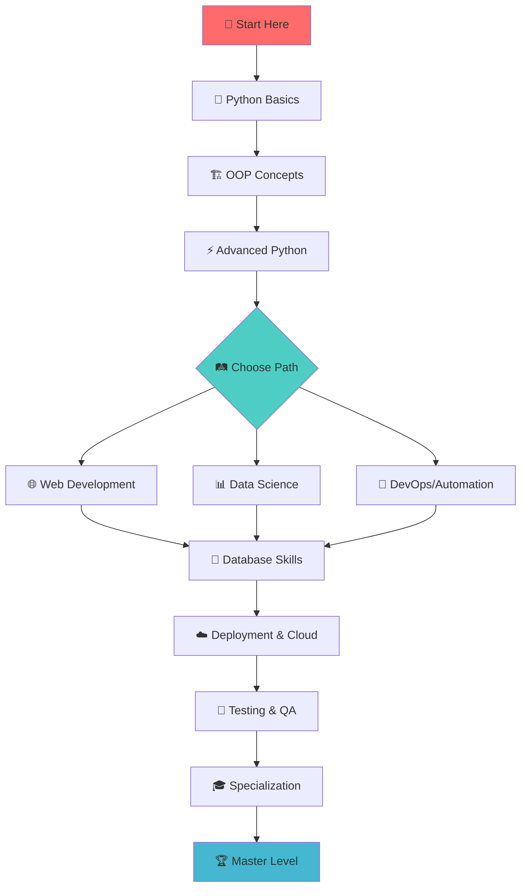

---

## 📊 Skill Level Progression

<div align="center">

| Level | Duration | Focus | Skills Gained |
|-------|----------|-------|---------------|
| 🌱 **Beginner** | 4 weeks | Fundamentals | Variables, Functions, Basic OOP |
| 🌿 **Intermediate** | 8 weeks | Web/Data | Frameworks, Databases, APIs |
| 🌳 **Advanced** | 12 weeks | Specialization | Architecture, Testing, Deployment |
| 🦋 **Expert** | 8+ weeks | Mastery | System Design, Leadership, Innovation |

</div>

---

## 🎯 Stage 1: Python Foundation (Weeks 1-4)

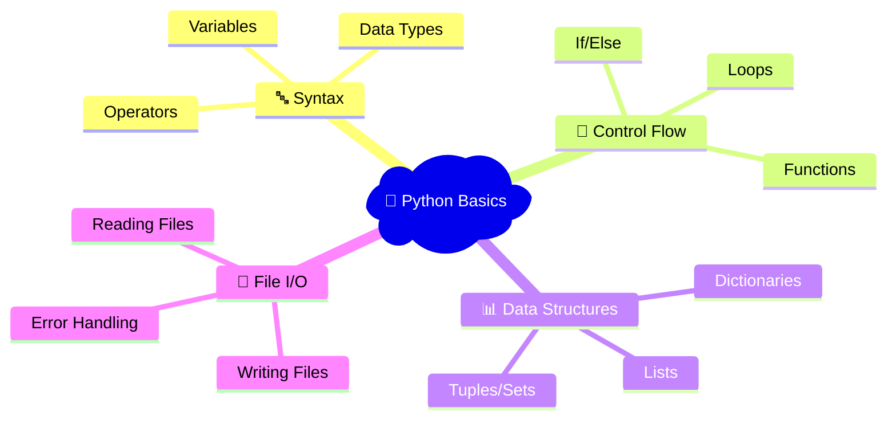

### 🎯 Core Concepts Checklist
<div align="center">

| Concept | Status | Resources |
|---------|--------|-----------|
| 🐍 Python Installation & Setup | ⚪ | [Python.org](https://python.org) |
| 📝 Variables & Data Types | ⚪ | Interactive Tutorial |
| 🔄 Control Structures | ⚪ | Practice Problems |
| 📊 Data Structures | ⚪ | Coding Exercises |
| ⚡ Functions & Scope | ⚪ | Project-based Learning |
| 📁 File Operations | ⚪ | Real-world Examples |
| ❌ Exception Handling | ⚪ | Error Debugging |

</div>

### 🛠️ Development Environment
```bash
# Essential Tools Setup
┌─────────────────────────────────┐
│  🐍 Python 3.11+               │
│  💻 VS Code / PyCharm          │
│  🐙 Git & GitHub               │
│  📦 pip & Virtual Environments │
│  🧪 Jupyter Notebooks          │
└─────────────────────────────────┘
```

---

## 🏗️ Stage 2: Object-Oriented Programming (Weeks 5-6)

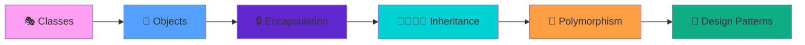

### 🎨 OOP Mastery Path
<details>
<summary>📚 Click to expand OOP concepts</summary>

```python
# 🏛️ Class Architecture Example
class PythonDeveloper:
    def __init__(self, name, level="Beginner"):
        self.name = name
        self.level = level
        self.skills = []
    
    def learn_skill(self, skill):
        self.skills.append(skill)
        print(f"🎉 {self.name} learned {skill}!")
    
    def level_up(self):
        levels = ["Beginner", "Intermediate", "Advanced", "Expert"]
        current = levels.index(self.level)
        if current < len(levels) - 1:
            self.level = levels[current + 1]
            print(f"🚀 Level up! Now {self.level}")
```

</details>

---

## ⚡ Stage 3: Advanced Python (Weeks 7-10)

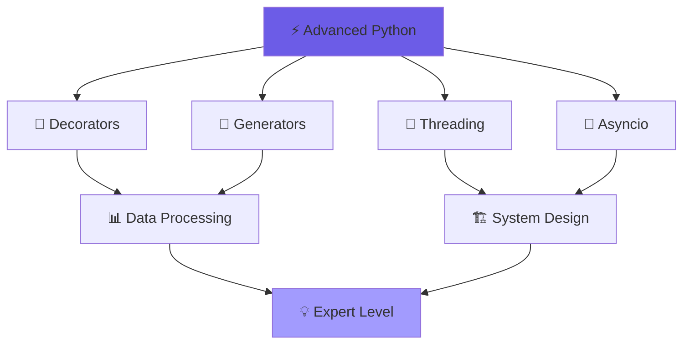

### 🔥 Advanced Features Matrix

<div align="center">

| Feature | Complexity | Use Cases | Projects |
|---------|------------|-----------|----------|
| 🎯 Decorators | ⭐⭐⭐ | Logging, Auth, Caching | API Middleware |
| 🔄 Generators | ⭐⭐⭐ | Memory Efficiency | Data Pipelines |
| 🧵 Threading | ⭐⭐⭐⭐ | Concurrent Tasks | Web Scraping |
| 🚀 Async/Await | ⭐⭐⭐⭐ | I/O Operations | Real-time Apps |
| 🏗️ Metaclasses | ⭐⭐⭐⭐⭐ | Framework Building | ORM Design |

</div>

---

## 🌐 Stage 4: Web Development (Weeks 11-16)

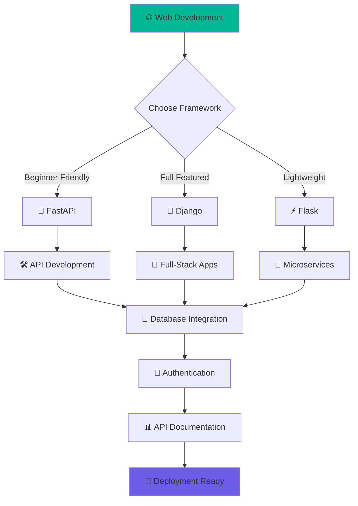

### 🎨 Framework Comparison

<div align="center">

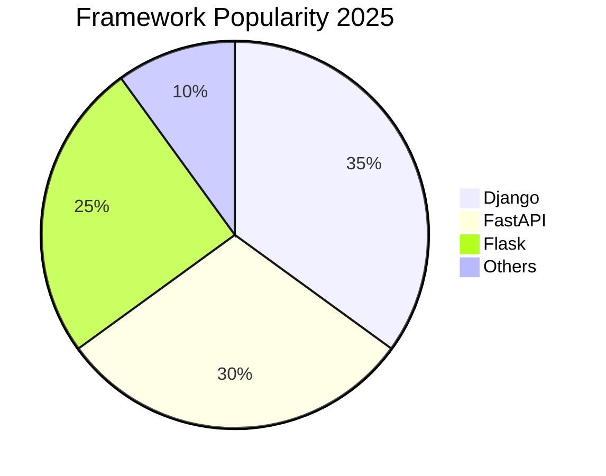

</div>

| Framework | Learning Curve | Best For | Community |
|-----------|----------------|----------|-----------|
| 🚀 **FastAPI** | ⭐⭐⭐ | APIs, Modern Apps | 🔥 Growing |
| 🎯 **Django** | ⭐⭐⭐⭐ | Full Applications | 🏆 Massive |
| ⚡ **Flask** | ⭐⭐ | Prototypes, Microservices | 💪 Strong |

---

## 💾 Stage 5: Database Mastery (Weeks 17-20)

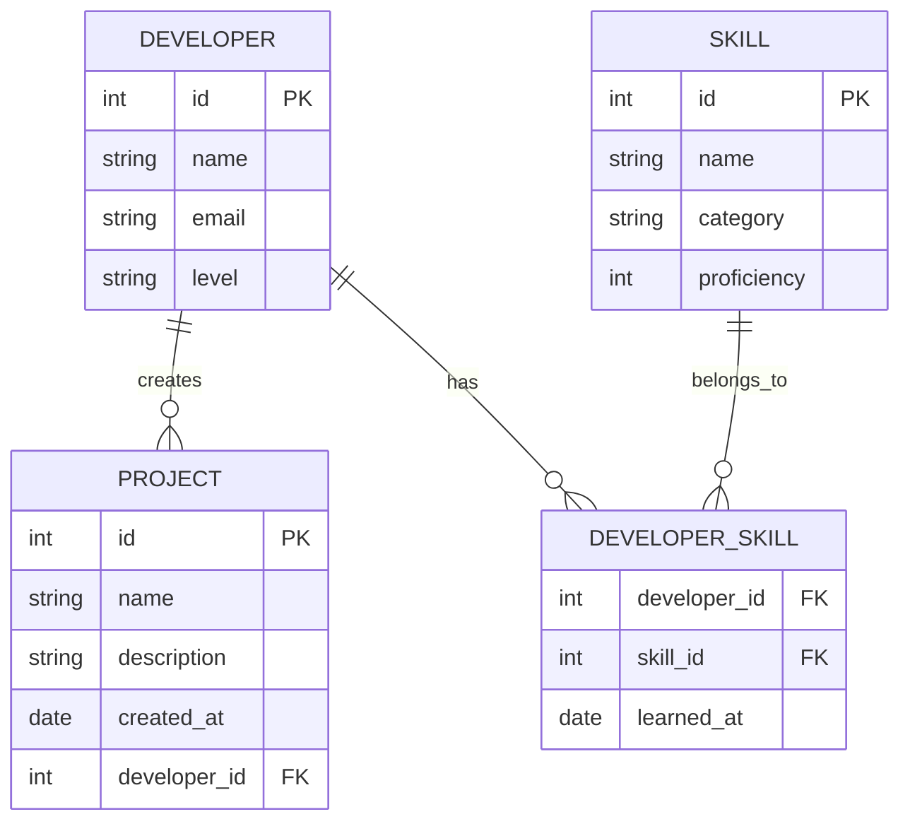

### 🗄️ Database Technology Stack

<div align="center">

| Database Type | Technology | Use Case | Difficulty |
|---------------|------------|----------|------------|
| 🐘 **Relational** | PostgreSQL | Complex Applications | ⭐⭐⭐ |
| 🗃️ **Document** | MongoDB | Flexible Schema | ⭐⭐ |
| ⚡ **Cache** | Redis | Session/Caching | ⭐⭐ |
| 📊 **Analytics** | SQLite | Development/Testing | ⭐ |

</div>

---

## ☁️ Stage 6: DevOps & Cloud (Weeks 21-24)

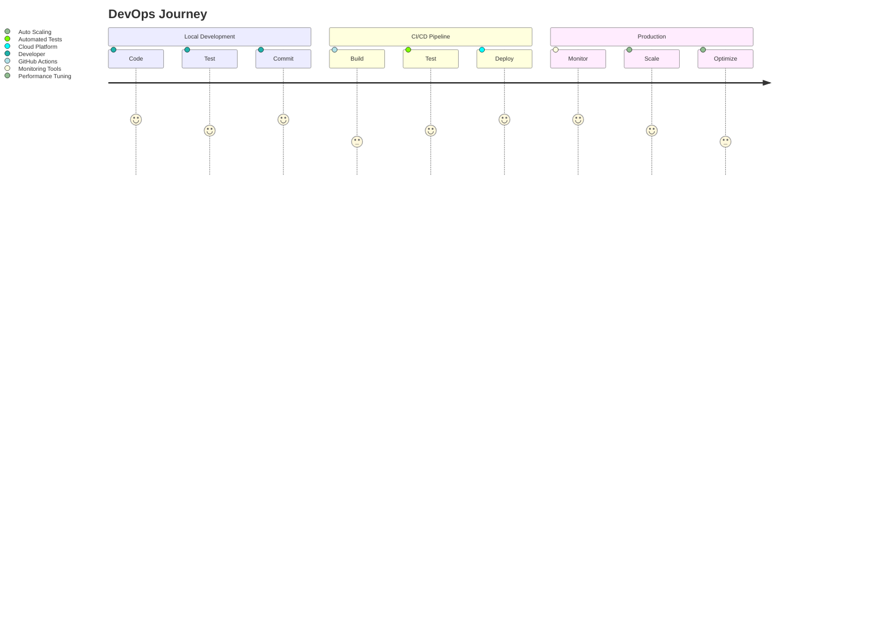

### 🐳 Containerization Workflow

```dockerfile
# 🐳 Dockerfile Example
FROM python:3.11-slim

WORKDIR /app
COPY requirements.txt .
RUN pip install --no-cache-dir -r requirements.txt

COPY . .
EXPOSE 8000

CMD ["uvicorn", "main:app", "--host", "0.0.0.0", "--port", "8000"]
```

### ☁️ Cloud Platforms Comparison

<div align="center">

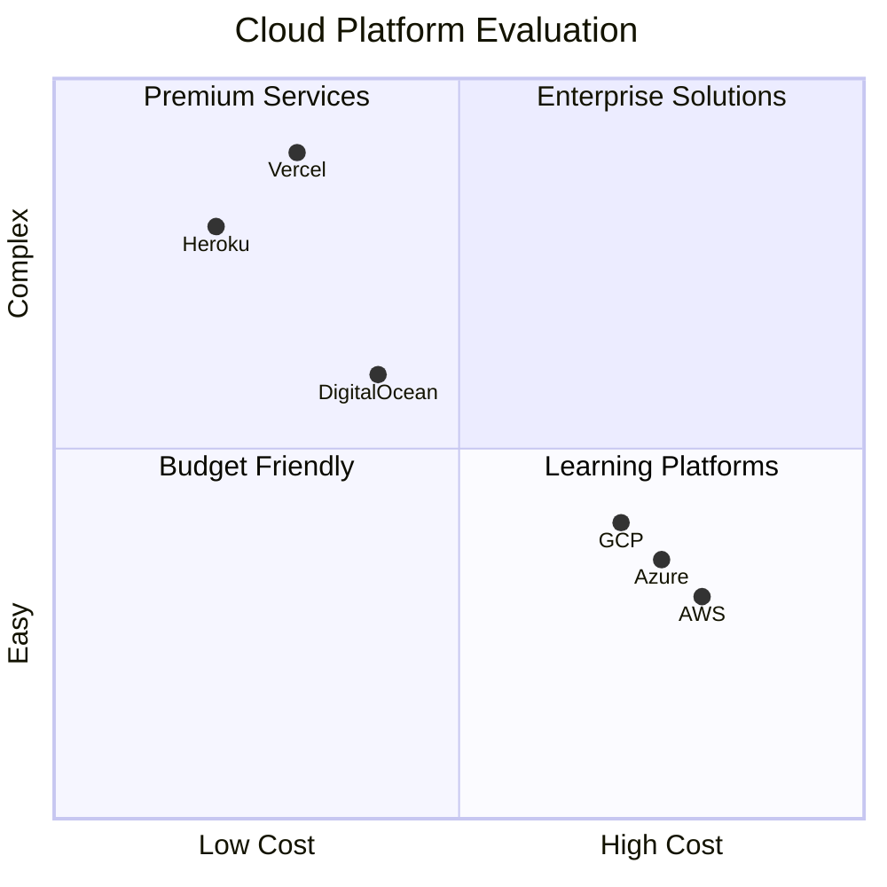

</div>

---

## 🧪 Stage 7: Testing & Quality (Weeks 25-26)

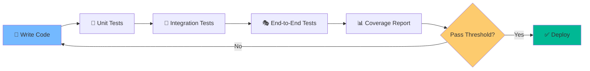

### 🎯 Testing Pyramid

<div align="center">

```
                    🎭
                 E2E Tests
                (Few, Slow)
               ╱─────────────╲
              ╱               ╲
             ╱  🔄 Integration  ╲
            ╱      Tests         ╲
           ╱    (Some, Medium)    ╲
          ╱─────────────────────────╲
         ╱                           ╲
        ╱         🧪 Unit Tests        ╲
       ╱          (Many, Fast)          ╲
      ╱─────────────────────────────────╲
```

</div>

---

## 🎯 Specialization Paths

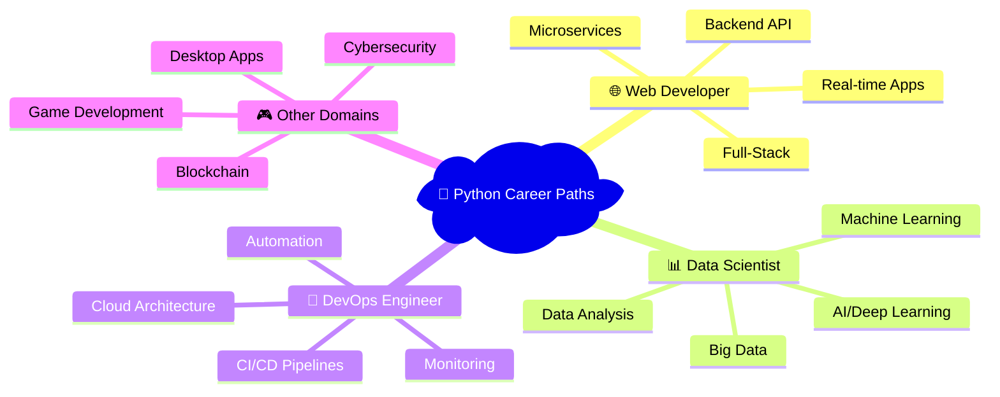

---

## 🏆 Project Portfolio Roadmap

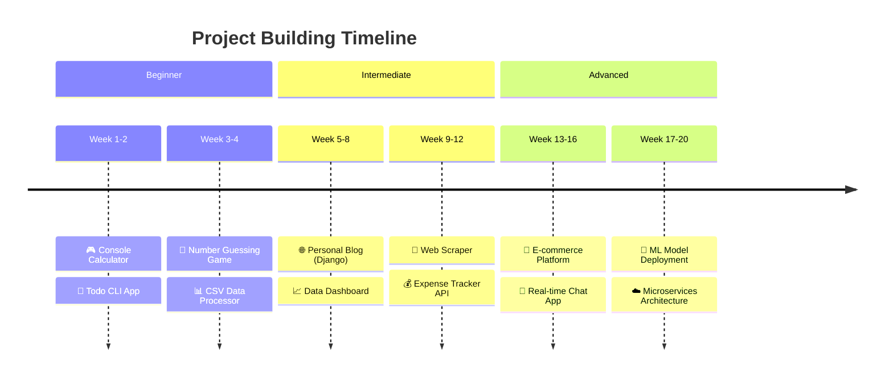

### 🎯 Project Difficulty Matrix

<div align="center">

| Project | Frontend | Backend | Database | Deployment | Total ⭐ |
|---------|----------|---------|----------|------------|----------|
| 🎮 Calculator | ⚪ | ⭐ | ⚪ | ⚪ | ⭐ |
| 🌐 Blog | ⭐⭐ | ⭐⭐ | ⭐ | ⭐ | ⭐⭐ |
| 🛒 E-commerce | ⭐⭐⭐ | ⭐⭐⭐ | ⭐⭐ | ⭐⭐ | ⭐⭐⭐ |
| 🤖 ML Platform | ⭐⭐ | ⭐⭐⭐⭐ | ⭐⭐ | ⭐⭐⭐ | ⭐⭐⭐⭐ |

</div>

---

## 📚 Learning Resources Hub

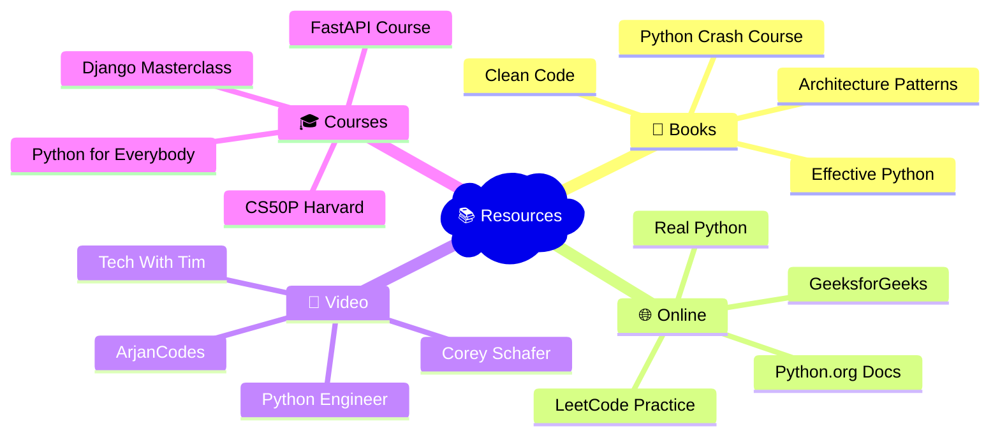

---

## 🎯 Skill Assessment Matrix

<div align="center">

### Rate Your Current Level (1-5 ⭐)

| Skill Category | Beginner | Intermediate | Advanced | Expert |
|----------------|----------|--------------|----------|--------|
| 🐍 **Python Syntax** | ⭐ | ⭐⭐ | ⭐⭐⭐ | ⭐⭐⭐⭐ |
| 🏗️ **OOP Design** | ⭐ | ⭐⭐ | ⭐⭐⭐ | ⭐⭐⭐⭐ |
| 🌐 **Web Development** | ⭐ | ⭐⭐ | ⭐⭐⭐ | ⭐⭐⭐⭐ |
| 💾 **Database Skills** | ⭐ | ⭐⭐ | ⭐⭐⭐ | ⭐⭐⭐⭐ |
| ☁️ **DevOps/Cloud** | ⭐ | ⭐⭐ | ⭐⭐⭐ | ⭐⭐⭐⭐ |
| 🧪 **Testing** | ⭐ | ⭐⭐ | ⭐⭐⭐ | ⭐⭐⭐⭐ |

</div>

---

## 🌟 Success Metrics & Goals

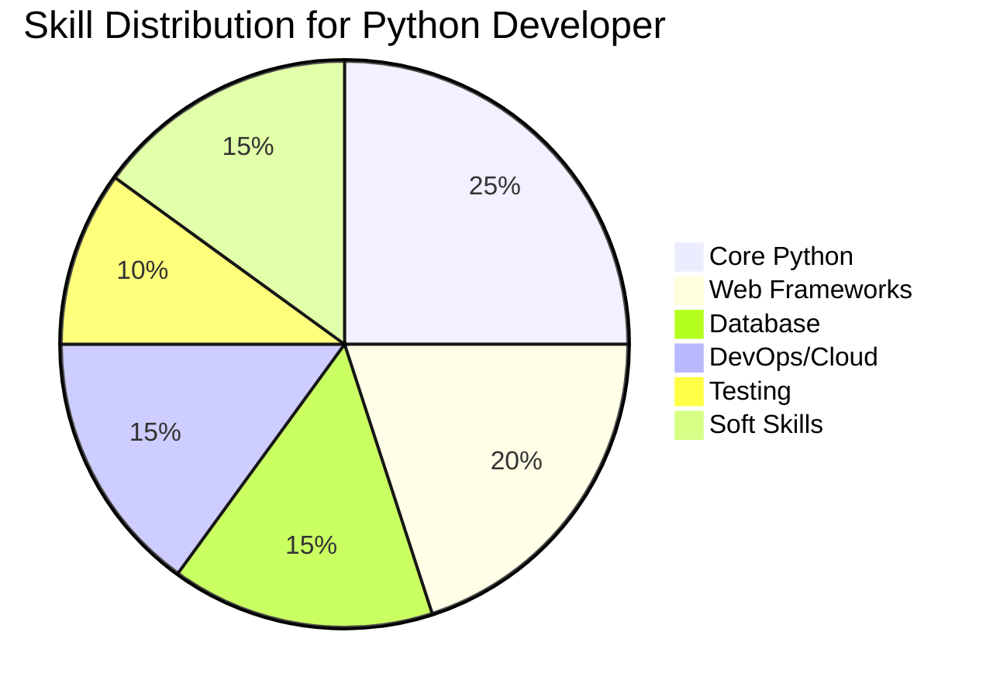

### 🎯 Monthly Goals Tracker

<div align="center">

| Month | Primary Focus | Projects | Skills | Achievement |
|-------|---------------|----------|---------|-------------|
| **Month 1** | 🐍 Python Basics | Calculator, Todo App | Syntax, Functions | 🥉 Bronze |
| **Month 2** | 🏗️ OOP & Advanced | Class-based Projects | Design Patterns | 🥈 Silver |
| **Month 3** | 🌐 Web Development | Blog, API | Django/FastAPI | 🥇 Gold |
| **Month 4** | 💾 Database & Deploy | Full-Stack App | SQL, Cloud | 🏆 Platinum |

</div>

---

## 🤝 Community & Networking

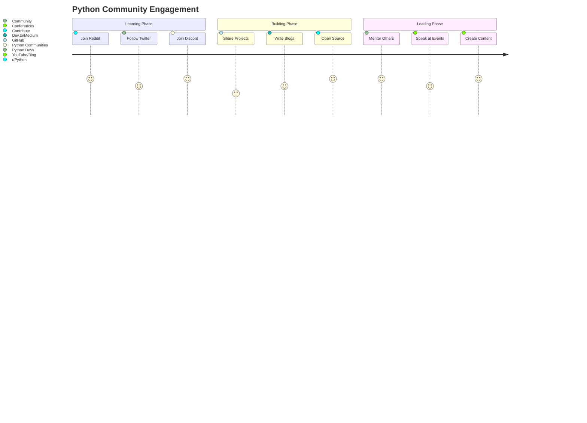

---

## 🚨 Common Pitfalls & Solutions

<div align="center">

| ❌ Pitfall | ✅ Solution | 🎯 Pro Tip |
|------------|-------------|-------------|
| Tutorial Hell | Build projects alongside learning | 80% doing, 20% reading |
| Perfectionism | Release MVP, iterate later | Done is better than perfect |
| Isolation | Join communities, find coding buddy | Learning together accelerates growth |
| Outdated Resources | Follow official docs, recent content | Check publish dates |
| No Version Control | Use Git from day one | Commit early, commit often |

</div>

---

## 🎓 Certification & Career Path

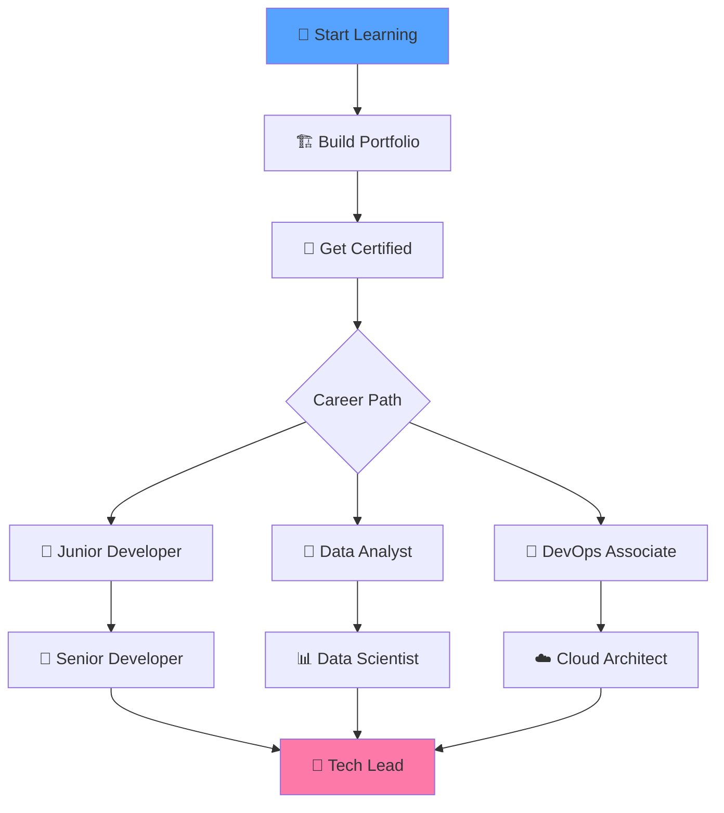

### 🏅 Recommended Certifications

- 🐍 **PCEP** - Certified Entry-Level Python Programmer
- 🏆 **PCAP** - Certified Associate Python Programmer  
- 👑 **PCPP** - Certified Professional Python Programmer
- ☁️ **AWS/GCP/Azure** - Cloud Platform Certifications

---

<div align="center">

## 🎉 Ready to Transform Your Career?

```
🚀 YOUR PYTHON JOURNEY STARTS HERE 🚀

          ╭─────────────────────╮
          │  🎯 Set Your Goal   │
          │  📅 Make a Plan     │
          │  💻 Start Coding    │
          │  🏗️ Build Projects  │
          │  🤝 Join Community  │
          │  🎓 Never Stop      │
          ╰─────────────────────╯
```

[](https://python.org)
[](https://discord.gg/python)
[](https://github.com)

---

### 🌟 Remember: *Every Expert Was Once a Beginner!* 🌟

**Fork ⭐ Share 🚀 Code 💻 Grow 📈**

*Happy Coding! 🐍✨*

</div>

---

<div align="center">

```
██████╗ ██╗   ██╗████████╗██╗  ██╗ ██████╗ ███╗   ██╗
██╔══██╗╚██╗ ██╔╝╚══██╔══╝██║  ██║██╔═══██╗████╗  ██║
██████╔╝ ╚████╔╝    ██║   ███████║██║   ██║██╔██╗ ██║
██╔═══╝   ╚██╔╝     ██║   ██╔══██║██║   ██║██║╚██╗██║
██║        ██║      ██║   ██║  ██║╚██████╔╝██║ ╚████║
╚═╝        ╚═╝      ╚═╝   ╚═╝  ╚═╝ ╚═════╝ ╚═╝  ╚═══╝

🎯 Master Python • 🚀 Build Amazing Things • 🏆 Achieve Your Dreams
```

</div>
