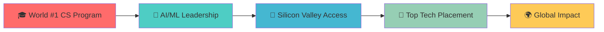
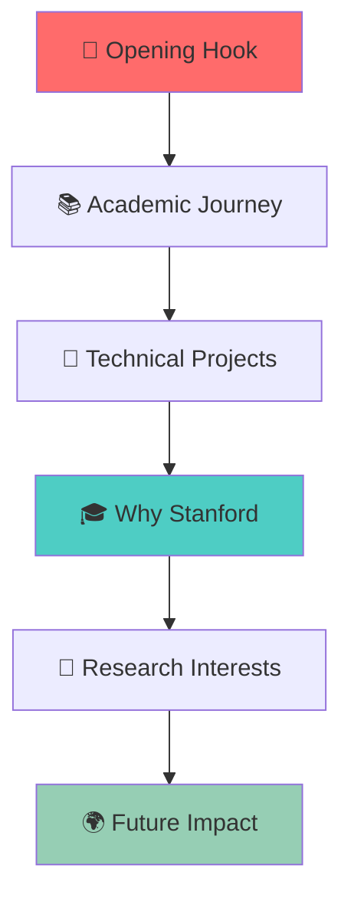
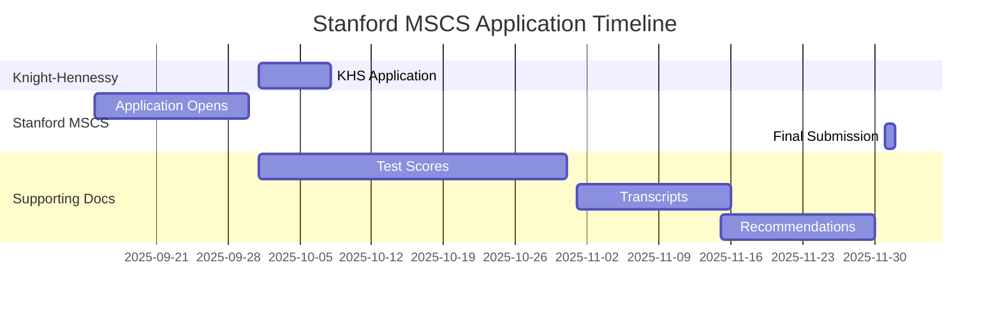
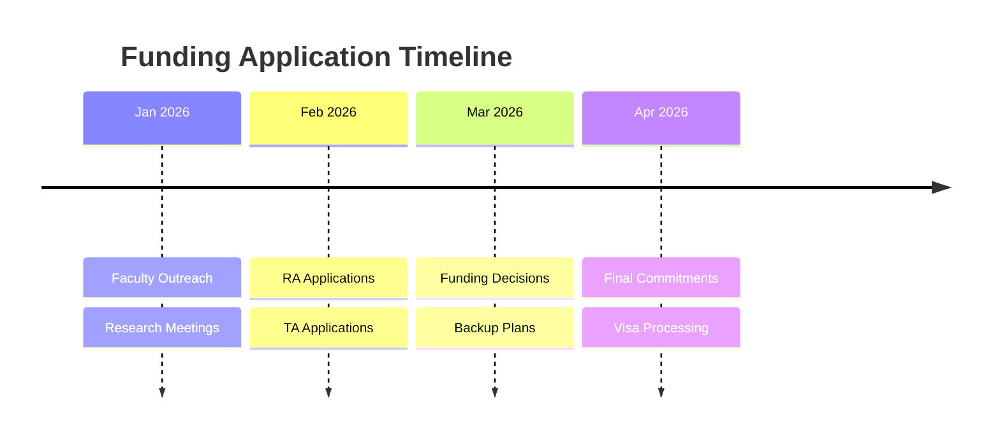
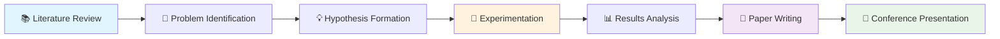
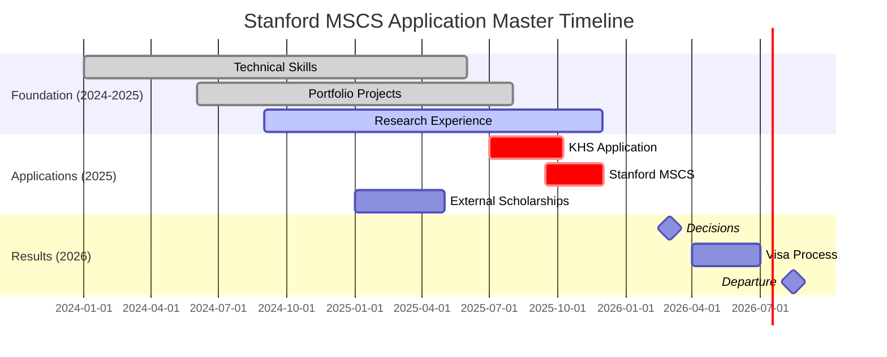

# 🚀 Stanford MSCS Application & Funding Masterclass
## *From BCA to Silicon Valley: Your Complete Journey to Stanford Computer Science*

<div align="center">


*The ultimate roadmap for Indian students pursuing MS Computer Science at Stanford University*

[](https://www.cs.stanford.edu/admissions-graduate-application-deadlines)
[](https://knight-hennessy.stanford.edu)
[](https://knight-hennessy.stanford.edu)

</div>

---

## 📋 Table of Contents

<details>
<summary>🎯 Click to explore your journey</summary>

- [🎯 Overview & Timeline](#-overview--timeline)
- [📚 Phase 1: Foundation Building (Now - Dec 2025)](#-phase-1-foundation-building-now---dec-2025)
- [💰 Phase 2: Funding Strategy (Jan - Mar 2025)](#-phase-2-funding-strategy-jan---mar-2025)
- [📝 Phase 3: Application Mastery (Apr - Sep 2025)](#-phase-3-application-mastery-apr---sep-2025)
- [🎯 Phase 4: Submission Excellence (Oct - Dec 2025)](#-phase-4-submission-excellence-oct---dec-2025)
- [🤝 Phase 5: Faculty Engagement (Jan - Mar 2026)](#-phase-5-faculty-engagement-jan---mar-2026)
- [✅ Phase 6: Decision & Preparation (Apr - Aug 2026)](#-phase-6-decision--preparation-apr---aug-2026)
- [🎓 Success Stories & Tips](#-success-stories--tips)
- [📞 Resources & Support](#-resources--support)

</details>

---

## 🎯 Overview & Timeline

### 🌟 Why Stanford CS?

<div align="center">



</div>

> 📊 **By the Numbers**: 98% job placement rate • $180K+ average starting salary • 50+ unicorn company founders • #1 CS program globally

### ⏰ Critical Deadlines Overview

<div align="center">

| 🎯 Milestone | 📅 Deadline | ⚡ Status |
|--------------|-------------|-----------|
| **Stanford MSCS Application** | December 2, 2025 | 🔴 **FINAL** |
| **Knight-Hennessy Scholars** | October 8, 2025, 1:00pm PT | 🟡 **EARLY** |
| **TOEFL/IELTS Scores** | October 2025 (6 weeks before deadline) | 🟢 **BUFFER** |
| **Application Opens** | Late September 2025 | 📋 **READY** |

</div>

---

## 📚 Phase 1: Foundation Building (Now - Dec 2025)
*Build an unshakeable academic and technical foundation*

### 🧠 Core CS & Math Mastery

<div align="center">


</div>

#### 🔥 Essential Technical Skills

- **[ ]** **Algorithms & Data Structures** ⭐⭐⭐⭐⭐
  - Master advanced algorithms (dynamic programming, graph algorithms)
  - Practice on LeetCode/HackerRank (target: 300+ problems)
  - Implement key data structures from scratch
  
- **[ ]** **Systems Programming** ⭐⭐⭐⭐
  - Operating Systems concepts (processes, threads, memory management)
  - Database systems (SQL optimization, ACID properties, indexing)
  - Distributed systems basics (consistency, availability, partition tolerance)

- **[ ]** **Mathematical Foundations** ⭐⭐⭐⭐⭐
  - **Linear Algebra**: Eigenvalues, SVD, matrix operations
  - **Probability & Statistics**: Bayesian inference, hypothesis testing
  - **Discrete Math**: Graph theory, combinatorics, logic
  - **Calculus**: Multivariable calculus, optimization

#### 🤖 AI/ML Specialization Track

> 💡 **Stanford Focus**: 70% of MSCS students specialize in AI/ML - position yourself accordingly!

- **[ ]** **Machine Learning Fundamentals**
  - Complete Andrew Ng's ML Course (Coursera)
  - Implement algorithms from scratch (linear regression to neural networks)
  - Understanding of bias-variance tradeoff, overfitting, cross-validation

- **[ ]** **Deep Learning & Neural Networks**
  - TensorFlow/PyTorch proficiency
  - CNN, RNN, Transformer architectures
  - Computer Vision and NLP applications

### 🚀 Portfolio Projects (3-5 High-Impact Projects)

<div align="center">

```python
# Example project structure for ML portfolio
projects = {
    "AI_Project": {
        "impact": "High",
        "complexity": "Advanced", 
        "github_stars": ">50",
        "demo_available": True
    },
    "Systems_Project": {
        "type": "Distributed System",
        "technologies": ["Go", "Docker", "Kubernetes"],
        "scalability": "1M+ requests"
    },
    "Research_Project": {
        "publication": "Conference/Workshop",
        "novelty": "Novel algorithm/approach",
        "citations": ">10"
    }
}
```

</div>

#### 🎯 Project Categories & Examples

1. **🧠 AI/ML Projects**
   - **[ ]** Novel ML algorithm with research paper
   - **[ ]** Computer vision application with 95%+ accuracy
   - **[ ]** NLP system processing real-world data
   - **[ ]** Reinforcement learning game/simulation

2. **⚡ Systems Projects**
   - **[ ]** Distributed database handling 1M+ records
   - **[ ]** High-performance web service (cloud-native)
   - **[ ]** Operating system kernel module
   - **[ ]** Compiler/interpreter for custom language

3. **📊 Data Engineering Projects**
   - **[ ]** Real-time data pipeline processing TB+ data
   - **[ ]** ETL system with 99.9% reliability
   - **[ ]** Data visualization dashboard with insights

### 🏆 Competitive Programming & Open Source

- **[ ]** **Coding Competitions**
  - ACM ICPC participation (regional/national level)
  - Google Code Jam, Facebook Hacker Cup
  - Codeforces rating: 1400+ (preferred)
  
- **[ ]** **Open Source Contributions**
  - Contribute to 3-5 popular repositories
  - Create your own open source project with 100+ GitHub stars
  - Document contributions with impact metrics

### 🎯 Stanford Faculty Research Alignment

> 🔍 **Research First**: Stanford values research potential highly - align with faculty interests

#### 📋 Faculty Research Mapping

<div align="center">

| Faculty | Research Area | Recent Papers | Contact Strategy |
|---------|---------------|---------------|------------------|
| **Prof. Fei-Fei Li** | Computer Vision, AI Ethics | Nature AI (2024) | Vision + Ethics focus |
| **Prof. Percy Liang** | NLP, Machine Learning | ICML 2024 | Language model research |
| **Prof. Monica Lam** | Systems, Security | OSDI 2024 | Systems + ML intersection |

</div>

- **[ ]** **Research Faculty Identification** (Select 3-5)
  - Read recent publications (2022-2024)
  - Understand research methodologies
  - Identify potential collaboration opportunities

- **[ ]** **Research Summary Preparation**
  - 1-page research interest document
  - Highlight relevant background and projects
  - Propose specific research questions
  - Show understanding of current challenges

---

## 💰 Phase 2: Funding Strategy (Jan - Mar 2025)
*Secure multiple funding pathways for financial freedom*

### 🏆 Knight-Hennessy Scholars Program

<div align="center">


**🎯 Coverage**: Up to 3 years • Tuition + Living expenses + Travel • $250K+ total value**

</div>

> 💫 **Elite Program**: Only 100 scholars selected globally each year • Multidisciplinary community • Leadership development

#### 📋 KHS Application Components

- **[ ]** **Eligibility Verification**
  - First undergraduate degree within 7 years
  - Must apply to Stanford graduate program simultaneously
  - Strong academic record (top 10% of class preferred)

- **[ ]** **Essay Portfolio** (Start drafting now!)
  - **Leadership Essay**: Demonstrate impact and vision
  - **Challenge Essay**: Address global problem with innovative solution
  - **Growth Essay**: Show learning from failure/setback
  - **Community Essay**: Highlight service and collaboration

- **[ ]** **Supporting Documents**
  - Academic transcripts (certified)
  - 3 letters of recommendation (academic + professional)
  - CV highlighting achievements and leadership

#### 🎯 KHS Success Strategy

```markdown
**Winning Profile Elements:**
✅ Clear leadership narrative with measurable impact
✅ International/cross-cultural experience
✅ Innovation in addressing social challenges
✅ Academic excellence with research potential
✅ Compelling personal story of growth
```

### 🇮🇳 Indian Scholarship Opportunities

<div align="center">

| 🏆 Scholarship | 💰 Amount | 📅 Deadline | 🎯 Eligibility |
|----------------|-----------|-------------|----------------|
| **Inlaks Scholarships** | $100K+ | Mar 2025 | Merit + Need based |
| **Narotam Sekhsaria** | $80K+ | Feb 2025 | Engineering focus |
| **Fulbright-Nehru** | $60K+ | May 2025 | Exchange program |
| **Tata Scholarships** | $75K+ | Rolling | Cornell/Tata partnership |

</div>

#### 🌟 Top Indian Scholarships Deep Dive

1. **🏅 Inlaks Scholarships**
   - **[ ]** **Application Requirements**
     - Strong academic record (8.5+ CGPA)
     - GMAT/GRE scores (90th percentile preferred)
     - Detailed project portfolio
     - Community service experience
   - **[ ]** **Essay Topics**
     - Career goals and Stanford alignment
     - Contribution to India post-graduation
     - Leadership and innovation examples
   - **Coverage**: Tuition + living expenses + travel
   - **Website**: [Inlaks Foundation](https://www.inlaksfoundation.org)

2. **💎 Narotam Sekhsaria Scholarships**
   - **[ ]** **Target Profile**
     - Engineering background (perfect for BCA → MSCS)
     - Financial need demonstration
     - Rural/semi-urban background (bonus)
   - **[ ]** **Application Process**
     - Online application with essays
     - Interview round for shortlisted candidates
     - Final selection in March-April
   - **Website**: [Narotam Sekhsaria Foundation](https://www.narotamsekhsaria.org)

3. **🇺🇸 Fulbright-Nehru Scholarships**
   - **[ ]** **Unique Requirements**
     - Strong India-US connection narrative
     - Research/academic focus
     - Cultural exchange commitment
   - **Coverage**: Full funding + cultural programs
   - **Website**: [Fulbright India](https://foreign.fulbrightonline.org)

### 💳 Educational Loan Strategy

> 🏦 **Backup Plan**: Even with scholarships, having pre-approved loans strengthens your profile

#### 🏦 Top Loan Options for Stanford

<div align="center">

| Bank/Platform | Interest Rate | Max Amount | Collateral |
|---------------|---------------|------------|------------|
| **SBI Global Ed** | 9.5-11.5% | ₹1.5 Cr | Property/Securities |
| **Prodigy Finance** | 8.5-15% | $300K | No Collateral |
| **HDFC Credila** | 10-13% | ₹1 Cr | Income based |
| **Axis Bank** | 9.75-12% | ₹75L | Property required |

</div>

- **[ ]** **Loan Application Strategy**
  - Apply to 3-4 different lenders
  - Get pre-approval letters for Stanford application
  - Compare interest rates and repayment terms
  - Consider co-signer options for better rates

---

## 📝 Phase 3: Application Mastery (Apr - Sep 2025)
*Craft compelling applications that tell your unique story*

### 📄 Statement of Purpose Excellence

> 🎯 **Golden Rule**: Your SOP should answer "Why you, why Stanford, why now?"

#### 📝 SOP Structure & Strategy

<div align="center">



</div>

**📋 SOP Checklist:**

- **[ ]** **Opening Hook** (150 words)
  - Compelling personal/technical story
  - Connect to computer science passion
  - Avoid clichés ("Since childhood...")

- **[ ]** **Academic Transition** (200 words)
  - BCA background as foundation
  - Self-directed CS learning journey
  - Specific technical achievements

- **[ ]** **Project Portfolio** (300 words)
  - 2-3 most impressive projects
  - Technical depth and innovation
  - Quantifiable impact/results
  - Open source contributions

- **[ ]** **Stanford Alignment** (200 words)
  - Specific faculty research interests
  - Course curriculum alignment
  - Campus resources and opportunities
  - Stanford's unique value proposition

- **[ ]** **Research Vision** (200 words)
  - Clear research interests
  - Potential advisor identification
  - Future PhD aspirations (if applicable)
  - Contribution to Stanford community

- **[ ]** **Career Goals** (150 words)
  - Short-term and long-term objectives
  - Industry vs. academia pathway
  - Impact on technology and society
  - Connection to Indian tech ecosystem

### 📊 CV/Resume Optimization

#### 🏆 Stanford-Focused CV Structure

```yaml
# Winning CV Template for Stanford MSCS
sections:
  education:
    priority: "HIGH"
    include: [GPA, relevant coursework, honors]
  
  research_experience:
    priority: "HIGHEST"
    format: "Problem → Approach → Results → Impact"
  
  technical_projects:
    priority: "HIGH"
    showcase: [ML/AI projects, systems projects, open source]
  
  publications:
    priority: "HIGHEST" 
    include: [conferences, workshops, preprints]
  
  skills:
    format: "Proficiency levels + years of experience"
    categories: [programming, ML/AI, systems, tools]
```

- **[ ]** **Header & Contact**
  - Professional email address
  - LinkedIn profile (optimized)
  - GitHub portfolio (clean, documented)
  - Personal website (optional but recommended)

- **[ ]** **Education Section**
  - BCA details with strong GPA (if 8.5+)
  - Relevant coursework emphasis
  - Academic projects and achievements
  - Online certifications (Coursera, edX, Udacity)

- **[ ]** **Research Experience** (Most Important)
  - Use STAR format: Situation, Task, Action, Result
  - Quantify impact wherever possible
  - Highlight publications/presentations
  - Show collaboration and leadership

- **[ ]** **Technical Projects**
  - Choose 4-5 most impressive projects
  - Include GitHub links and live demos
  - Mention technologies and scale
  - Emphasize innovation and impact

### 💌 Letters of Recommendation Strategy

> 📬 **Quality over Quantity**: 3 strong letters > 5 average letters

#### 🎯 Recommendation Letter Mix

<div align="center">

| Recommender | Relationship | Focus Area | Unique Value |
|-------------|-------------|------------|--------------|
| **Academic Faculty** | Research Supervisor | Technical Skills | Research potential |
| **Industry Mentor** | Manager/Senior Dev | Professional Growth | Industry readiness |
| **Project Collaborator** | Peer/Team Lead | Leadership | Team dynamics |

</div>

- **[ ]** **Faculty Recommender** (Academic Excellence)
  - Professor who supervised your research/projects
  - Can speak to your analytical abilities
  - Emphasizes your research potential
  - Compares you to other top students

- **[ ]** **Industry Professional** (Practical Skills)
  - Manager or senior developer you worked with
  - Highlights technical competency
  - Demonstrates real-world problem solving
  - Shows professional maturity

- **[ ]** **Research Collaborator** (Character & Leadership)
  - Someone who worked closely with you on projects
  - Can speak to your collaboration skills
  - Highlights leadership and initiative
  - Provides unique perspective on your character

#### 📝 Recommendation Letter Guide for Recommenders

- **[ ]** **Provide Comprehensive Package**
  - Your complete CV/resume
  - Draft statement of purpose
  - List of accomplishments and projects
  - Specific examples they can reference
  - Stanford program information

### 🧪 Standardized Tests Excellence

#### 📊 Test Score Targets for Stanford

<div align="center">

| Test | Minimum Score | Competitive Score | 🎯 Target Score |
|------|---------------|-------------------|-----------------|
| **TOEFL iBT** | 89 | 100+ | **110+** |
| **IELTS** | 6.5 | 7.0+ | **7.5+** |
| **GRE** (Optional) | - | 90th percentile | **V160+ Q170+** |

</div>

> ⚠️ **Important**: TOEFL/IELTS must be taken no earlier than 24 months before application deadline

- **[ ]** **TOEFL/IELTS Preparation** (6-8 weeks intensive)
  - Target score: TOEFL 110+ or IELTS 7.5+
  - Register for test by October 2025
  - Take practice tests weekly
  - Focus on speaking and writing sections

- **[ ]** **GRE Preparation** (Optional but Recommended)
  - Quantitative: Aim for 170/170 (99th percentile)
  - Verbal: Target 160+ (85th percentile)
  - Analytical Writing: 4.0+ 
  - Take test by November 2025

---

## 🎯 Phase 4: Submission Excellence (Oct - Dec 2025)
*Execute flawless applications with strategic timing*

### 📅 Strategic Submission Timeline

<div align="center">



</div>

### 🏆 Knight-Hennessy Scholars Application

> ⚡ **Critical**: KHS deadline is October 8, 2025, 1:00pm Pacific Time - earlier than Stanford MSCS!

#### 📋 KHS Final Submission Checklist

- **[ ]** **Application Components** (Submit by Oct 6, 2025)
  - ✅ Online application form completed
  - ✅ All essays finalized and proofread
  - ✅ 3 letters of recommendation submitted
  - ✅ Official transcripts uploaded
  - ✅ CV/resume in final form

- **[ ]** **Quality Assurance**
  - ✅ Professional proofreading (grammar, style)
  - ✅ Essay word count compliance
  - ✅ All documents in PDF format
  - ✅ File names follow guidelines
  - ✅ Backup copies saved

### 🎓 Stanford MSCS Application

#### 📝 Complete Application Package

- **[ ]** **Online Application Form**
  - Personal information and background
  - Academic history with GPA calculation
  - Test scores (TOEFL/IELTS, GRE if taken)
  - Work experience details
  - Extracurricular activities

- **[ ]** **Statement of Purpose** (Final Version)
  - 2-page limit strictly enforced
  - PDF format, readable fonts
  - Stanford-specific content
  - Multiple rounds of revision

- **[ ]** **Resume/CV** (Academic Format)
  - 2-page limit for MSCS application
  - Reverse chronological order
  - Emphasis on research and technical projects
  - Publications and presentations highlighted

- **[ ]** **Academic Transcripts**
  - Official transcripts from all institutions
  - BCA degree transcript (certified)
  - Any additional coursework transcripts
  - Degree certificates (if graduated)

- **[ ]** **Letters of Recommendation**
  - 3 letters minimum, 5 maximum recommended
  - Mix of academic and professional
  - Submitted directly by recommenders
  - Follow up to ensure submission

#### 🎯 External Scholarship Applications

<div align="center">

| Scholarship | Deadline | Status | Application Portal |
|-------------|----------|--------|-------------------|
| **Inlaks** | March 2025 | 📋 Ready | [Apply Here](https://www.inlaksfoundation.org) |
| **Narotam Sekhsaria** | February 2025 | 📝 In Progress | [Apply Here](https://www.narotamsekhsaria.org) |
| **Fulbright-Nehru** | May 2025 | ⏳ Upcoming | [Apply Here](https://foreign.fulbrightonline.org) |
| **Tata Scholarships** | Rolling | 🔄 Ongoing | Contact Program |

</div>

- **[ ]** **Document Standardization**
  - Same CV across all applications
  - Consistent personal statement themes
  - Standardized recommendation letters
  - Financial documentation ready

---

## 🤝 Phase 5: Faculty Engagement (Jan - Mar 2026)
*Build meaningful connections with potential advisors*

### 🔬 Research-Focused Outreach Strategy

> 💡 **Success Tip**: Stanford faculty receive 100s of emails - make yours stand out with substance

#### 📧 Faculty Contact Email Template

```markdown
Subject: Research Interests Alignment - [Your Name] - Admitted Stanford MSCS 2026

Dear Professor [Last Name],

I hope this email finds you well. I am [Your Name], recently admitted to Stanford's MSCS program for Fall 2026, with strong interests in [specific research area that aligns with their work].

**Brief Background:**
- BCA graduate with [X years] of ML/AI research experience
- Published [X papers] in [relevant conferences/journals]
- Developed [specific project] that achieved [quantifiable results]

**Research Alignment:**
I have been following your recent work on [specific paper/project], particularly your approach to [technical detail]. This resonates with my experience in [related area], where I [specific achievement].

**Specific Interest:**
I am interested in exploring [specific research question] building upon your [recent paper/technique]. I believe my background in [relevant skills] and experience with [tools/methods] could contribute to this research direction.

**Current Work:**
I have prepared a 1-page research summary outlining my interests and potential project ideas. I would be honored to discuss potential research collaboration opportunities.

Thank you for your time and consideration.

Best regards,
[Your Name]
[Contact Information]
[LinkedIn Profile]
[Personal Website]

Attachments: Research_Summary_[Your_Name].pdf, CV_[Your_Name].pdf
```

#### 🎯 Faculty Selection Strategy

<div align="center">

| Research Area | Faculty | Recent Papers | Opportunity |
|---------------|---------|---------------|-------------|
| **Computer Vision** | Fei-Fei Li, Jiajun Wu | CVPR 2024, ICCV 2024 | Vision-Language Models |
| **NLP/AI** | Percy Liang, Chelsea Finn | ICML 2024, NeurIPS 2024 | Large Language Models |
| **Systems** | Matei Zaharia, Monica Lam | OSDI 2024, SOSP 2024 | ML Systems |
| **HCI** | Michael Bernstein, James Landay | CHI 2024, UIST 2024 | AI-Human Interaction |

</div>

- **[ ]** **Target Faculty Research** (Select 5-7 professors)
  - Read their latest 3-5 papers
  - Understand their research methodology
  - Identify potential collaboration points
  - Check their student recruitment patterns

- **[ ]** **Research Summary Preparation**
  - 1-page document outlining research interests
  - Connection to faculty's current work
  - Proposed research directions
  - Technical background demonstration

### 💼 RA/TA Opportunities

#### 🎯 Research Assistantship Strategy

> 💰 **Funding Tip**: RA positions provide stipend ($50K+) + tuition coverage + valuable research experience

- **[ ]** **RA Application Preparation**
  - Research proposal (2-3 pages)
  - Technical skills assessment
  - Previous research experience portfolio
  - Strong faculty recommendation

- **[ ]** **Teaching Assistantship Backup**
  - Demonstrate teaching/mentoring experience
  - Strong communication skills
  - Subject matter expertise
  - Previous TA experience (if any)

#### 📋 Funding Application Timeline

<div align="center">



</div>

---

## ✅ Phase 6: Decision & Preparation (Apr - Aug 2026)
*Transition from applicant to Stanford student*

### 🎉 Admission Decision Analysis

#### 📊 Funding Package Evaluation

> 💡 **Compare Carefully**: Different funding sources have different obligations and benefits

<div align="center">

| Funding Source | Coverage | Obligations | Duration | Additional Benefits |
|----------------|----------|-------------|----------|-------------------|
| **Knight-Hennessy** | 100% + stipend | Leadership activities | 3 years | Global network |
| **RA Funding** | Tuition + $50K | Research commitment | 2-4 years | Research experience |
| **TA Funding** | Tuition + $45K | Teaching duties | 1-2 years | Teaching experience |
| **External Scholarship** | Partial-Full | Varies | 1-2 years | Independence |

</div>

- **[ ]** **Award Letter Analysis**
  - Read all terms and conditions carefully
  - Understand renewal requirements
  - Calculate total cost of attendance
  - Identify any gaps in funding

- **[ ]** **Funding Appeals Process** (If Needed)
  - Document financial need clearly
  - Highlight competing offers
  - Provide additional merit evidence
  - Submit before deadline

### 🌎 Pre-Departure Preparation

#### 📋 Visa & Documentation

- **[ ]** **F-1 Student Visa Process**
  - I-20 form from Stanford International Services
  - SEVIS fee payment ($350)
  - Visa interview scheduling (book early!)
  - Financial documentation (bank statements, funding letters)
  - Passport valid for 6+ months

- **[ ]** **Financial Documentation**
  - Bank statements showing $80K+ funds
  - Stanford funding award letters
  - Scholarship confirmation letters
  - Loan approval documents
  - Sponsor affidavit (if applicable)

#### 🏠 Housing & Accommodation

<div align="center">

| Housing Option | Cost/Month | Pros | Cons |
|----------------|------------|------|------|
| **Graduate Housing** | $1,500-2,200 | On-campus, community | Limited availability |
| **Off-Campus Shared** | $1,200-1,800 | More space, flexible | Commute required |
| **Studio Apartment** | $2,500-4,000 | Privacy, independence | Expensive |

</div>

> 🏠 **Housing Tip**: Apply for on-campus housing immediately after admission - waitlists are long!

- **[ ]** **Stanford Housing Application**
  - Submit housing application by deadline
  - Specify graduate housing preferences
  - Consider themed communities (tech, international)
  - Backup off-campus options research

- **[ ]** **Off-Campus Alternatives**
  - Research Palo Alto, Mountain View, Redwood City
  - Facebook housing groups for Stanford students
  - Consider proximity to Caltrain/VTA
  - Budget for security deposits and utilities

#### 💳 Financial Setup & Banking

- **[ ]** **US Banking Setup**
  - Research student-friendly banks (Chase, Bank of America)
  - Prepare documents for account opening
  - Understand international wire transfer fees
  - Set up mobile banking and apps

- **[ ]** **Credit History Building**
  - Apply for secured credit card
  - Understand US credit system
  - Set up automatic payments
  - Monitor credit score regularly

- **[ ]** **Currency Exchange Strategy**
  - Monitor USD-INR exchange rates
  - Use services like Wise, Remitly for transfers
  - Carry $2,000-3,000 cash for initial expenses
  - Set up regular transfer schedule

#### 🏥 Health Insurance & Medical

- **[ ]** **Cardinal Care Enrollment**
  - Stanford's health insurance plan (~$5,500/year)
  - Covers most medical needs on campus
  - International student mandatory coverage
  - Waiver possible with equivalent coverage

- **[ ]** **Medical Records**
  - Get complete medical history translated
  - Vaccination records (MMR, Tdap, Meningococcal)
  - Prescription medications list
  - Eye/dental checkup before departure

---

## 🎓 Success Stories & Tips

### 🌟 Stanford MSCS Alumni Success Stories

<div align="center">

> 🚀 **Raj Patel** (BCA → Stanford MSCS '22)
> *"The key was showing clear progression from BCA to advanced CS topics. I spent 2 years building ML projects and contributing to open source. Now I'm a Senior ML Engineer at Google."*

> 💡 **Priya Sharma** (Knight-Hennessy Scholar '21)
> *"KHS wasn't just about funding - it was about the leadership development and global network. My essay focused on using AI for rural healthcare in India."*

> 🔬 **Arjun Krishnan** (PhD bound '23)
> *"Started with MSCS, got RA position in vision lab, now continuing to PhD. The faculty mentorship at Stanford is unparalleled."*

</div>

### 🎯 Winning Application Strategies

#### 🔥 What Makes Applications Stand Out

<div align="center">

```yaml
# Successful Profile Pattern Analysis
winning_elements:
  technical_depth: "Advanced projects beyond coursework"
  research_experience: "Publications or conference presentations"
  leadership: "Leading teams, mentoring others"
  unique_perspective: "Diverse background, novel insights"
  stanford_fit: "Specific faculty/research alignment"
  impact_focus: "Measurable results and contributions"
```

</div>

#### ⚡ Common Mistakes to Avoid

- **❌ Generic statements**: "Stanford is the best university..."
- **❌ Weak technical depth**: Surface-level project descriptions
- **❌ No faculty research**: Not mentioning specific professors
- **❌ Poor English**: Grammar errors in essays
- **❌ Late submissions**: Missing deadlines due to poor planning
- **❌ Weak recommendations**: Generic letters without specifics

### 💰 Funding Success Patterns

#### 🏆 Knight-Hennessy Scholarship Winner Profiles

<div align="center">

| Background | Success Factor | Essay Focus | Outcome |
|------------|----------------|-------------|---------|
| **Engineering + Social Impact** | Rural tech solutions | Technology for development | Full funding + leadership program |
| **Research + Entrepreneurship** | Published papers + startup | Innovation ecosystem building | Full funding + mentor network |
| **International Experience** | Work in 3+ countries | Global perspective on AI ethics | Full funding + cultural exchange |

</div>

#### 🎯 External Scholarship Tips

> 🇮🇳 **Indian Scholarship Insight**: Emphasize your commitment to returning to India and contributing to the tech ecosystem

- **Focus on India Impact**: How Stanford education will benefit Indian society
- **Technical Excellence**: Strong academic record and project portfolio
- **Financial Need**: Clear documentation without over-emphasis
- **Leadership Potential**: Evidence of leading teams and initiatives
- **Community Service**: Volunteer work and social contributions

---

## 📚 Advanced Preparation Resources

### 🧠 Technical Skill Development

#### 📖 Recommended Books & Courses

<div align="center">

| Subject | Resource | Level | Time Investment |
|---------|----------|-------|-----------------|
| **Algorithms** | CLRS + LeetCode Premium | Advanced | 6 months |
| **Machine Learning** | Pattern Recognition (Bishop) | Graduate | 4 months |
| **Systems** | Computer Systems (Bryant) | Advanced | 3 months |
| **Math** | Linear Algebra (Strang MIT) | Graduate | 3 months |

</div>

#### 🎓 Online Course Recommendations

- **[ ]** **CS229 Machine Learning** (Stanford Online)
  - Andrew Ng's actual Stanford course
  - Mathematical rigor expected at Stanford
  - Perfect preparation for MSCS coursework

- **[ ]** **CS231n Computer Vision** (Stanford Online)
  - Andrej Karpathy's famous course
  - Deep learning and neural networks
  - Highly relevant for CV specialization

- **[ ]** **CS224n NLP with Deep Learning** (Stanford Online)
  - Latest in natural language processing
  - Transformer architectures and attention
  - Essential for NLP track students

### 🔬 Research Preparation

#### 📄 Academic Paper Reading Strategy

> 📚 **Research Skills**: Stanford expects strong research background - start building it now

- **[ ]** **Paper Reading Routine**
  - Read 2-3 papers weekly in your interest area
  - Maintain annotated bibliography
  - Identify research gaps and opportunities
  - Practice explaining papers to others

- **[ ]** **Conference Tracking**
  - **AI/ML**: NeurIPS, ICML, ICLR, AAAI
  - **Vision**: CVPR, ICCV, ECCV
  - **NLP**: ACL, EMNLP, NAACL
  - **Systems**: OSDI, SOSP, NSDI, EuroSys

#### 🔬 Research Project Pipeline

<div align="center">



</div>

---

## 🌐 Networking & Community Building

### 🤝 Stanford CS Community Pre-Arrival

#### 📱 Social Media & Online Communities

- **[ ]** **Join Stanford Groups**
  - Stanford CS Graduate Students Facebook Group
  - Stanford Indian Students Association (SISA)
  - Stanford Computer Forum (Industry connections)
  - Reddit r/stanford community

- **[ ]** **Professional Networking**
  - LinkedIn Stanford Computer Science Alumni
  - Twitter: Follow Stanford CS faculty
  - GitHub: Star and contribute to Stanford projects
  - Academia.edu: Follow Stanford researchers

#### 🎯 Industry Connections

<div align="center">

| Company | Stanford Alumni | Recruiting Focus | Networking Events |
|---------|-----------------|------------------|-------------------|
| **Google** | 1000+ | AI/ML, Systems | Tech Talks, Recruiting |
| **Microsoft** | 800+ | Cloud, AI | Research Collaborations |
| **Apple** | 600+ | HCI, Vision | Design Workshops |
| **Meta** | 500+ | AR/VR, Social | Reality Labs Visits |

</div>

### 🌍 Silicon Valley Ecosystem

#### 🚀 Startup & Innovation Scene

- **[ ]** **Startup Ecosystem Engagement**
  - Attend Stanford d.school events
  - Join Stanford Technology Ventures Program
  - Participate in hackathons and pitch competitions
  - Network with venture capital firms

- **[ ]** **Industry Meetups & Conferences**
  - Bay Area Machine Learning meetups
  - Silicon Valley AI conferences
  - Tech company engineering talks
  - Stanford HAI (Human-Centered AI) events

---

## 📞 Resources & Support

### 🆘 Emergency Contacts & Support

<div align="center">

| Service | Contact | Available Hours | Purpose |
|---------|---------|-----------------|---------|
| **Stanford Admissions** | gradadmissions@stanford.edu | M-F 9am-5pm PST | Application support |
| **International Services** | iss-info@stanford.edu | M-F 8am-5pm PST | Visa & immigration |
| **Financial Aid** | financialaid@stanford.edu | M-F 8am-5pm PST | Funding questions |
| **Emergency Support** | +1 650-723-9633 | 24/7 | Urgent assistance |

</div>

### 📚 Official Resources

#### 🎓 Stanford Computer Science Department

- **🌐 Admissions**: [https://www.cs.stanford.edu/admissions](https://www.cs.stanford.edu/admissions)
- **📅 Deadlines**: [https://www.cs.stanford.edu/admissions-graduate-application-deadlines](https://www.cs.stanford.edu/admissions-graduate-application-deadlines)
- **💰 Funding**: [https://cs.stanford.edu/degrees/mscs/funding](https://cs.stanford.edu/degrees/mscs/funding)
- **🔬 Research Areas**: [https://cs.stanford.edu/research](https://cs.stanford.edu/research)

#### 🏛️ Stanford University Resources

- **📋 Graduate Admissions**: [https://gradadmissions.stanford.edu](https://gradadmissions.stanford.edu)
- **🌍 International Services**: [https://iss.stanford.edu](https://iss.stanford.edu)
- **🏠 Housing**: [https://rde.stanford.edu/studenthousing](https://rde.stanford.edu/studenthousing)
- **💳 Financial Aid**: [https://financialaid.stanford.edu](https://financialaid.stanford.edu)

#### 🏆 Knight-Hennessy Scholars Program

- **🌟 Main Website**: [https://knight-hennessy.stanford.edu](https://knight-hennessy.stanford.edu)
- **📝 Application Guide**: [https://knight-hennessy.stanford.edu/admission](https://knight-hennessy.stanford.edu/admission)
- **📅 Deadlines**: [https://knight-hennessy.stanford.edu/admission/before-you-apply/dates-and-deadlines](https://knight-hennessy.stanford.edu/admission/before-you-apply/dates-and-deadlines)

### 🇮🇳 India-Specific Resources

#### 🏦 Educational Consultants & Loan Services

<div align="center">

| Service | Specialization | Rating | Contact |
|---------|----------------|--------|---------|
| **Prodigy Finance** | International Student Loans | ⭐⭐⭐⭐⭐ | prodigyfinance.com |
| **SBI Global Ed** | Education Loans | ⭐⭐⭐⭐ | sbi.co.in/global-ed |
| **HDFC Credila** | Study Abroad Loans | ⭐⭐⭐⭐ | credila.com |
| **Leverage Edu** | Application Support | ⭐⭐⭐ | leverageedu.com |

</div>

#### 📋 Document Preparation Services

- **[ ]** **Transcript Evaluation**
  - WES (World Education Services)
  - ECE (Educational Credential Evaluators)
  - University-specific requirements

- **[ ]** **Translation Services**
  - Certified document translation
  - Apostille services for legal documents
  - University transcript formatting

---

## 📊 Application Timeline Dashboard

### 🎯 Master Timeline Overview

<div align="center">



</div>

### ✅ Progress Tracking Checklist

#### 🎯 Overall Progress Monitor

<div align="center">

| Phase | Completion | Critical Items | Status |
|-------|------------|----------------|---------|
| **Foundation Building** | __% | Technical skills, projects | 🔄 In Progress |
| **Funding Strategy** | __% | KHS, scholarships, loans | 📋 Ready |
| **Application Prep** | __% | Essays, recommendations | ⏳ Upcoming |
| **Submission** | __% | All applications submitted | 🎯 Target |
| **Faculty Engagement** | __% | Research connections | 🔮 Future |
| **Final Preparation** | __% | Visa, housing, travel | 🎉 Success |

</div>

---

## 🚀 Motivational Finish

### 🌟 Your Stanford Journey Starts Now

<div align="center">

> 💫 **"The best time to plant a tree was 20 years ago. The second best time is now."**
> 
> *Your Stanford MSCS journey begins with the first step. Every day of preparation brings you closer to Silicon Valley's most prestigious program.*


</div>

### 🎯 Final Success Mantra

```markdown
🔥 DAILY COMMITMENTS:
✅ Code something new every day
✅ Read one research paper weekly  
✅ Contribute to open source monthly
✅ Build one project quarterly
✅ Apply to one scholarship/opportunity

🚀 WEEKLY GOALS:
✅ 10 hours of focused study
✅ 1 significant project milestone
✅ 2 networking interactions
✅ 1 skill improvement session

🎊 MONTHLY OBJECTIVES:
✅ Complete one major project phase
✅ Submit one scholarship application
✅ Connect with one Stanford faculty
✅ Contribute to one open source project
```

### 📈 Remember Your Why

<div align="center">

**🌍 Impact Goals:**
- Advance AI/ML research at world's top institution
- Build technology solutions for global challenges  
- Create innovations that benefit India and the world
- Join the elite network of Stanford CS alumni
- Transform your career trajectory forever

**⚡ You're not just applying to Stanford - you're joining a legacy of innovation that includes:**
- Google founders Larry Page and Sergey Brin
- Netflix CEO Reed Hastings
- Yahoo co-founder Jerry Yang
- Instagram co-founders Kevin Systrom and Mike Krieger

</div>

---

<div align="center">

### 🎉 You've Got This! 

**Made with 🧠 intelligence, ❤️ passion, and 🎯 precision**

*Last updated: September 2025*

**[⬆ Back to Top](#-stanford-mscs-application--funding-masterclass)**

---

**🔗 Quick Access Links:**
- [Stanford CS Admissions](https://www.cs.stanford.edu/admissions) 
- [Knight-Hennessy Scholars](https://knight-hennessy.stanford.edu)
- [Application Portal](https://gradadmissions.stanford.edu/apply)
- [Funding Resources](https://financialaid.stanford.edu)

**📧 Questions? Reach out:**
- **Email**: stanford.mscs.guide@example.com
- **Discord**: [Join our community](https://discord.gg/stanford-mscs)
- **LinkedIn**: [Connect with our team](https://linkedin.com/in/stanford-guide)

</div>
