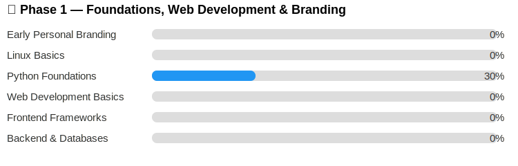

<h2 align="left"># नमस्ते! 👋 मैं अविनाश हूँ</h2>

---

🎓 **बीसीए छात्र** | **उभरता हुआ सॉफ्टवेयर इंजीनियर** | Python और DSA सीख रहा हूँ  
मैं वर्तमान में सॉफ्टवेयर इंजीनियरिंग में बैचलर ऑफ कंप्यूटर एप्लीकेशंस (BCA) कर रहा हूँ। मुझे Python सीखने का बहुत शौक है, Data Structures और Algorithms (Striver DSA शीट के जरिए) में महारत हासिल करना चाहता हूँ, और साफ-सुथरा, शुरुआती के लिए आसान कोड लिखना पसंद करता हूँ।  
🎯 *लक्ष्य:* 2027 तक सॉफ्टवेयर इंजीनियर बनना।

---

## 🚀 तकनीकी स्टैक

  
  
  
  
  

---

## 🛠️ पसंदीदा टूल्स

**प्रोडक्टिविटी और कोडिंग:**  

  
  
  
  
  
  

**VS Code एक्सटेंशन्स:**  
`Python`, `Jupyter`, `Prettier`, `GitLens`, `Docker`, `Code Runner`, `Material Icon Theme`, `Better Comments`, `LeetCode`

---

---

## 💻 प्रमुख प्रोजेक्ट

- 🐍 [100 दिनों की Python चुनौती](https://github.com/AvinashNegi1999/100-Days-of-Python-Code-challenge) – मेरी रोज़ाना Python सीखने की यात्रा, कोड, लॉजिक और प्रोजेक्ट्स के साथ

---

👨‍💻 मेरा पोर्टफोलियो है 

## 📢 मुझसे जुड़ें

  
  
  
  

## 📊 GitHub और कोडिंग आँकड़े

<table style="border-collapse: collapse; width: 100%;">
  <tr>
    <td align="center" style="background: #FBFBFB; padding: 15px; border-radius: 8px;">
      <b style="color: #1B1433; font-family: Ubuntu, sans-serif;">LeetCode</b> 
      
    </td>
    <td align="center" style="background: #FBFBFB; padding: 15px; border-radius: 8px;">
      <b style="color: #1B1433; font-family: Ubuntu, sans-serif;">GitHub आँकड़े</b> 
      
    </td>
  </tr>
  <tr>
    <td align="center" style="background: #FBFBFB; padding: 15px; border-radius: 8px;">
      <b style="color: #1B1433; font-family: Ubuntu, sans-serif;">GitHub Streak</b> 
      
    </td>
    <td align="center" style="background: #FBFBFB; padding: 15px; border-radius: 8px;">
      <b style="color: #1B1433; font-family: Ubuntu, sans-serif;">शीर्ष भाषाएँ</b> 
      
    </td>
  </tr>
</table>

<!-- 📈 GitHub Activity Graph -->

  <h2 align="center" style="color: #1B1433; font-family: 'Ubuntu', sans-serif; font-size: 22px; margin-bottom: 10px;">
    📈 GitHub गतिविधि
  </h2>
  

    मेरी कोडिंग यात्रा कमिट्स में! 🚀
  

  

<!-- Visitor Counter -->

  

 
👨‍💻 मेरी कोडिंग यात्रा

मैंने अपनी प्रोग्रामिंग यात्रा **C** और **Python** से शुरू की, छोटे-छोटे प्रोजेक्ट्स और समस्या-समाधान अभ्यासों के साथ। समय के साथ मैं तकनीकी साक्षात्कारों के लिए **डाटा स्ट्रक्चर और एल्गोरिदम** में महारत हासिल करने, **फुल-स्टैक डेवलपमेंट** में दक्षता पाने, और **AI/ML** की खोज करने पर ध्यान केंद्रित करूंगा।

वर्तमान में, मैं लगातार GitHub कमिट्स और विस्तृत Notion नोट्स के माध्यम से अपनी प्रगति को दस्तावेज़ित कर रहा हूँ — अपने कौशल को शुरुआती से उत्पादन-योग्य विशेषज्ञता में बदल रहा हूँ। मेरी सीखने की फिलॉसफी सरल है:  
**_हर दिन सीखो, हर सप्ताह बनाओ, हर महीने सुधार करो._**

---

> 💬 “पहले समस्या को हल करें। फिर, कोड लिखें।” — जॉन जॉनसन
